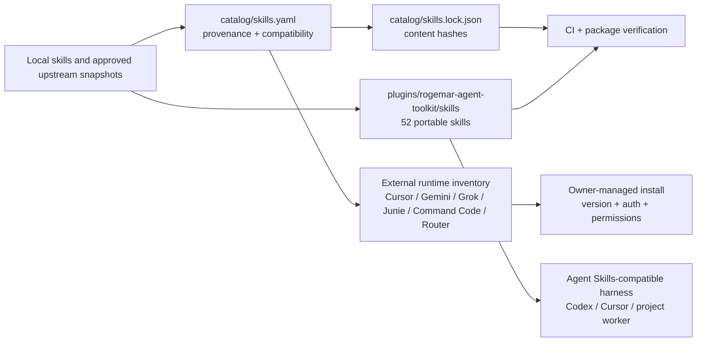
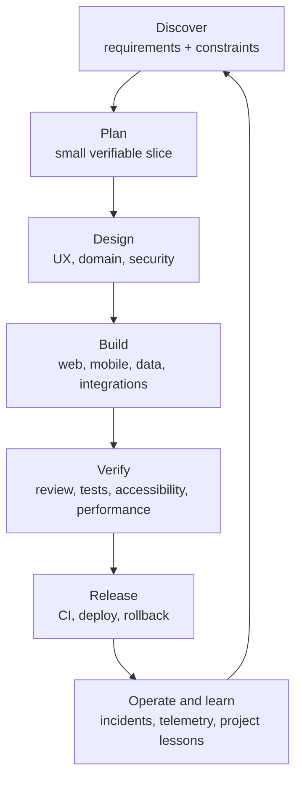

# Rogemar Agent Toolkit

Private, versioned engineering skills and runtime inventory for Codex, Cursor,
Antigravity/Gemini, Grok Build, Junie, Command Code, and compatible Agent
Skills harnesses on macOS, Linux, and WSL.

Source repository: [digitalpilipinas/rogemar-agent-toolkit](https://github.com/digitalpilipinas/rogemar-agent-toolkit) (private; GitHub access is required).

## Table of contents

- [At a glance](#at-a-glance)
- [What this repository contains](#what-this-repository-contains)
- [Architecture](#architecture)
- [Compatibility and evidence](#compatibility-and-evidence)
- [Agile workflow map](#agile-workflow-map)
- [Workflow-to-skill matrix](#workflow-to-skill-matrix)
- [Framework and operating-system routes](#framework-and-operating-system-routes)
- [Install and use](#install-and-use)
- [Choosing a profile and harness](#choosing-a-profile-and-harness)
- [Upstream and third-party skills](#upstream-and-third-party-skills)
- [Complete skill inventory](#complete-skill-inventory)
- [Release, upgrade, and rollback](#release-upgrade-and-rollback)
- [Safety, provenance, and privacy](#safety-provenance-and-privacy)
- [Development and validation](#development-and-validation)
- [Known limits](#known-limits)

## At a glance

| Capability | What you get | Evidence state |
| --- | --- | --- |
| Portable bundle | 52 checked-in, project-agnostic `SKILL.md` trees | Verified locally |
| Codex | Portable Agent Plugin plus Codex marketplace manifests | Verified structurally; fresh-task discovery remains a separate check |
| Cursor | Project-local `.agents/skills` installation, plus documented native/plugin dependencies | Portable discovery is supported; native cache activation is unverified |
| Other harnesses | Runtime inventory and install boundaries for Antigravity/Gemini, Grok Build, Junie, Command Code, and codex-router | Audit-observed catalog entries; fresh VM/cloud activation is unverified |
| Reproducibility | SemVer package version, generated README inventory, lockfile hashes, and deterministic release archives | Verified locally |

## What this repository contains

The toolkit has one canonical tree under
`plugins/rogemar-agent-toolkit/skills/`. It is exposed through:

1. the portable Agent Plugin `plugin.json` manifest;
2. the Codex `.codex-plugin/plugin.json` manifest and repository marketplace;
3. a copied project/user installer that writes to `.agents/skills/`; and
4. a catalog of external skills and runtime integrations that must be installed
   by their owning harness.

The distinction matters: copying a Markdown file cannot reproduce a proprietary
connector, provider login, MCP server, native binary, permission model, or
harness-specific automation. The catalog records those dependencies without
pretending they are portable.

## Architecture



The architecture diagram is representative; the generated inventory below is
the complete catalog index, including pstack, GoalBuddy, codex-router, and
other provider-managed groups.

Portable skills are copied atomically and can be rolled back. Runtime-managed
skills remain at their source and are reported as ready, missing, or
activation-unverified by the documentation and diagnostic commands.

## Compatibility and evidence

| Harness or environment | Supported path | Current evidence boundary |
| --- | --- | --- |
| Codex | Install the repository marketplace or the portable skill tree | Manifests and local validators pass; fresh-task discovery must still be tested after reinstall |
| Cursor | Install project skills into `.agents/skills`; add Cursor plugins separately | Agent Skills layout is supported; native `skills-cursor` and marketplace activation are runtime-managed |
| Antigravity/Gemini | Install the runtime and its extension plugins; keep project overlays with the project | Catalog-audited built-ins/configuration; fresh CLI/IDE activation is unverified |
| Codex Router | Follow the upstream repository for its optional companion skills | Catalog-audited repository integration; installation and activation are unverified |
| Grok Build | Install Grok Build and its bundled/plugin families | Catalog-audited bundle/plugins; provider authentication and activation are unverified |
| Junie | Install Junie through JetBrains; use the separate Codex supervisor when appropriate | Catalog-audited runtime; no direct Codex ACP bridge is implied by this repository |
| Command Code | Install the provider/router runtime; shared skills resolve from `.agents/skills` | Catalog-audited runtime; no independent redistributable Command Code skill source found |
| macOS, Linux, WSL | Use the copied installer with Python 3.9+ | Installer and package checks are local evidence; fresh Linux/WSL smoke testing remains separate |

## Agile workflow map



## Workflow-to-skill matrix

Use the smallest row that covers the risk. External skills are additions, not
automatic prerequisites; install them only when the target harness and project
actually need them.

| Agile moment | Web apps (React, Next, Vite, static) | Mobile apps (Expo, React Native, iOS, Android) | Data, native, and cross-harness work | Primary skills / tools |
| --- | --- | --- | --- | --- |
| Discover and plan | Repository map, requirements, source research, acceptance criteria | Activity schema, offline constraints, release targets, device matrix | Provider/runtime constraints and project policy | `agent-map`, `knowledge-base-answering`, `research-synthesizer`, `create-plan`, `workflow-orchestrator`, `plan-model-router`, external `goalbuddy`, `pstack` |
| UX and domain design | Information architecture, responsive states, design tokens | Safe areas, touch targets, offline/error states, activity contracts | Figma or harness-native design tools where enabled | `ux-flow-architect`, `design-system-steward`, `interaction-polish`, `motion-animation-engineer`, `accessibility-auditor`, `activity-schema-guardian` |
| Implement | Components, routing, APIs, browser flows, SEO, game loops | Expo/RN vertical slices, native setup, permissions, sync, instrumentation | Supabase/RPC, provider adapters, Python/data workflows | `supabase`, `supabase-guardian`, `offline-sync-auditor`, `playwright`, `develop-web-game`, `csv-analytics-reporter`, `agent-collaboration-terminal` |
| Review and test | Unit/integration/E2E, browser smoke, visual and accessibility checks | Emulator/device flows, performance, permissions, screenshot diff | Security, privacy, schema, connector and model boundaries | `code-review-tests`, `test-architecture-engineer`, `visual-qa`, `security-best-practices`, `privacy-safety-review`, `performance-profiler`; external `argent-*` |
| Release | CI, preview, CDN/hosting, GitHub review, rollback | Store/release readiness, native build checks, staged rollout | Cloud/provider readiness and evidence separation | `deploy-checklist`, `gh-fix-ci`, `gh-address-comments`, `vercel-deploy`, `netlify-deploy`, `cloudflare-deploy`, `mobile-release-manager` |
| Operate and learn | Bugs, regressions, content and SEO iteration | Offline recovery, crash/performance signals, device regressions | Provider handoffs, bounded external-agent reviews, project lessons | `bug-triage`, `project-learning`, `meeting-notes-task-extractor`, `seo-content-strategy`, `agent-collaboration-terminal`, external `codex-router` |

For a multi-sprint or already-approved programme, use `first-time-right-delivery`
for evidence gates and `deliver-approved-programme` for bounded execution after
approval. GoalBuddy can hold the goal and handoff state; pstack supplies
Cursor-native principles and playbooks; codex-router supplies optional routing
and companion skills. These remain separate, owner-managed dependencies.

## Framework and operating-system routes

The portable tree is harness-neutral. Choose the row that matches the project
runtime, then add only the provider-owned tools needed for that environment.

| Project surface | Recommended route | Useful external/runtime additions |
| --- | --- | --- |
| React, Next.js, Vite, static web | Install to `.agents/skills`; use browser, Playwright, UX, accessibility, and deployment skills | Cursor or Codex browser tools; Vercel, Netlify, or Cloudflare owner-managed plugins |
| Expo / React Native | Install to the project; preserve offline, permissions, and release gates | Argent emulator/device/flow skills; Expo and mobile-release runtime packages |
| Native iOS / Android / TV | Install to the project; validate on simulator/emulator/device | Argent setup, profiling, screenshot, and TV skills; platform SDKs remain separate |
| Supabase-backed applications | Pair schema/RPC work with server-authority and privacy checks | Supabase plugin/MCP and authenticated CLI, installed separately |
| Python, analytics, research, or data apps | Use research, CSV, documents, and security skills with explicit evidence | Gemini/Antigravity data plugins or other provider tools, after owner review |
| macOS, Linux, or WSL | Run the Python 3.9+ installer and keep copied skills in the project | Native harnesses and credentials are installed per host; WSL/cloud smoke tests remain required |

## Install and use

### Project installation (recommended)

Pinned project installation is designed for local checkouts, VMs, and cloud
workers. Target-environment readiness still requires a smoke test there:

```bash
git clone https://github.com/digitalpilipinas/rogemar-agent-toolkit.git
cd rogemar-agent-toolkit
git fetch --tags
# Use a release tag when one exists; until then, stay on main.
git switch main
python3 scripts/toolkit.py verify
python3 scripts/toolkit.py install \
  --target project \
  --project-root /path/to/project
```

The installer writes to `<project>/.agents/skills/`, refuses unmanaged conflicts,
and records a managed lock state. For Cursor Cloud or a remote worker, install
the project skills before the agent starts.

### User installation and development links

```bash
python3 scripts/toolkit.py install --target user
python3 scripts/toolkit.py install --target user --link   # development only
python3 scripts/toolkit.py doctor
```

Copied installs are the portable default. `--link` is useful only while editing
this repository on the same machine.

### Codex marketplace

For a local checkout, register the repository marketplace once and install the
plugin:

```bash
codex plugin marketplace add /absolute/path/to/rogemar-agent-toolkit
codex plugin add rogemar-agent-toolkit@personal
```

Start a new Codex task after reinstalling. A private GitHub workspace import
requires an authorized workspace administrator. External plugins such as
GoalBuddy, pstack, Argent, or provider runtimes require their own installation
and authentication steps.

### External runtimes and plugins

Install the portable tree first, then add provider-owned capabilities through
the target harness. The commands below are intentionally owner-managed: they
must not receive credentials from this repository.

| Harness or provider | Add its skills/plugins | Boundary |
| --- | --- | --- |
| Cursor | In Cursor, run `/add-plugin pstack` or add Team Kit from the marketplace | Native skills, plugin cache, and authentication remain Cursor-managed |
| Antigravity/Gemini | Install the official CLI or IDE, then enable the required extension families | Built-ins, configured skills, and credentials stay in the Gemini runtime |
| Grok Build | Install Grok Build, then add each plugin from its author-supported source | Bundled skills, plugins, sessions, and provider auth stay with Grok |
| JetBrains Junie | Install Junie through JetBrains; use the separate supervisor only when its protocol is supported | Junie native skills and IDE state are not repackaged here |
| Command Code | Install Command Code from its supported distribution | The package is marked UNLICENSED; no payload is redistributed |
| codex-router | Follow the [upstream repository](https://github.com/duolahypercho/codex-router) installation | Router skills are optional external additions and activation remains unverified |


## Choosing a profile and harness

The `all` profile is the default: it installs all 52 portable skills and records
all known external dependencies. It does not silently install credentials,
connectors, native runtimes, or proprietary caches.

| Need | Choose | Why |
| --- | --- | --- |
| Reproducible project or cloud worker | `--target project` from a SemVer tag | Skills travel with the project and can be rebuilt on a clean VM |
| Shared local skills | `--target user` | One copied skill tree for compatible local harnesses |
| Developing the toolkit itself | `--link` | Fast iteration; do not use for release images |
| Cursor-native workflows | Portable install plus `/add-plugin pstack` or Team Kit as needed | Native Cursor skills remain Cursor-managed |
| Grok, Antigravity, or Junie collaboration | Install the provider runtime, then use `agent-collaboration-terminal` | The adapter coordinates providers but does not replace their runtimes |
| Command Code routing | Install Command Code or codex-router separately | The toolkit supplies shared skills, not the provider binary or credentials |

## Upstream and third-party skills

This toolkit includes Rogemar-maintained material and selected snapshots with
recorded provenance. Third-party work remains owned by its original author;
inclusion here does not rebrand it as Rogemar-authored. License and
redistribution status varies, and unknown items remain unverified—see
[LICENSE](LICENSE) before copying or republishing anything. The pinned toolkit
release is reproducible. Use “latest” commands only after reviewing the upstream
diff, license, and target-harness compatibility.

| Author / publisher | Skills or runtime represented | Canonical source | Latest or owner-managed install |
| --- | --- | --- | --- |
| OpenAI | Codex system skills and official plugin families | [openai/plugins](https://github.com/openai/plugins) | Current Codex built-in marketplace |
| Supabase | `supabase` and Supabase runtime family | [supabase/agent-skills](https://github.com/supabase/agent-skills) | `npx skills add supabase/agent-skills` |
| CodeRabbit | `code-review`, `autofix` | [coderabbitai/skills](https://github.com/coderabbitai/skills) | `npx skills add coderabbitai/skills` |
| Software Mansion | Argent mobile/TV/device/QA workflows | [software-mansion/argent](https://github.com/software-mansion/argent) | `npx @swmansion/argent@latest init --local` |
| Leonxlnx | `unlazy` | [Leonxlnx/unlazy](https://github.com/Leonxlnx/unlazy) | `npx skills add Leonxlnx/unlazy` |
| Lauren Tan / poteto | Cursor pstack | [cursor/plugins](https://github.com/cursor/plugins) | In Cursor: `/add-plugin pstack` |
| Cursor | Built-ins and Cursor Team Kit | [cursor/plugins](https://github.com/cursor/plugins) | Use the Cursor runtime/plugin marketplace |
| tolibear | GoalBuddy | [tolibear/goalbuddy](https://github.com/tolibear/goalbuddy) | `npx goalbuddy@latest` |
| Remotion | Remotion plugin dependency and upstream skill family | [remotion-dev/skills](https://github.com/remotion-dev/skills) | `npx skills add remotion-dev/skills` |
| Chrome DevTools Team | Chrome DevTools plugin family | [chrome-devtools-mcp](https://github.com/ChromeDevTools/chrome-devtools-mcp) | Follow the runtime's installation |
| Google / Google DeepMind | Modern Web Guidance and science skills | [modern-web-guidance](https://github.com/GoogleChrome/modern-web-guidance), [science-skills](https://github.com/google-deepmind/science-skills) | Follow the Gemini/Antigravity runtime |
| Exa / Firecrawl / Sentry | Grok Build plugin families | [Exa](https://github.com/exa-labs/exa-grok-plugin), [Firecrawl](https://github.com/firecrawl/firecrawl-grok-plugin), [Sentry](https://github.com/getsentry/plugin-grok) | Follow each provider's Grok installation |
| Jesse Vincent / obra | Superpowers plugin family | [obra/superpowers](https://github.com/obra/superpowers) | Follow the upstream installation |
| Vercel | Vercel Agent Skills and Grok plugin | [agent-skills](https://github.com/vercel-labs/agent-skills), [vercel-plugin](https://github.com/vercel/vercel-plugin) | Follow the target harness installation |
| JetBrains | Junie runtime | [JetBrains/junie](https://github.com/JetBrains/junie) | Install through JetBrains; verify protocol support |
| duolahypercho | codex-router skills | [duolahypercho/codex-router](https://github.com/duolahypercho/codex-router) | Follow the repository's documented installation |

The cross-harness `npx skills add ...` commands use the open-source
[Vercel Skills CLI](https://github.com/vercel-labs/skills). They do not update
this toolkit's pinned lockfile automatically. After intentionally refreshing a
vendored upstream, run `toolkit.py lock`, `toolkit.py verify`, and the tests.

## Complete skill inventory

The generated inventory below is the source-of-truth index for what this
release contains and what it resolves from an external runtime. Every portable
skill links to its checked-in `SKILL.md`. Every external group lists its members,
purpose, author/status, provenance, source, and install path. “Source author not declared”
means the snapshot did not carry author metadata; it is not a claim that the
work has no author.

<!-- BEGIN GENERATED SKILL INVENTORY -->
<!-- This section is generated by scripts/inventory_readme.py; edit the catalog or SKILL.md instead. -->
### Vendored portable skills (52)

| Skill | Purpose | Declared author / provenance | Source and upstream | License / redistribution |
| --- | --- | --- | --- | --- |
| [`accessibility-auditor`](plugins/rogemar-agent-toolkit/skills/accessibility-auditor/SKILL.md) | Use for accessibility reviews or implementation involving semantic structure, keyboard and focus behavior, screen readers, ARIA, live announcements, contrast, touch targets, Dynamic Type, reduced motion, forms, errors, and automated plus manual a11y evidence. | Source author not declared; snapshot maintained by Rogemar | [SKILL.md](plugins/rogemar-agent-toolkit/skills/accessibility-auditor/SKILL.md) | Not declared in snapshot; review before redistribution |
| [`activity-schema-guardian`](plugins/rogemar-agent-toolkit/skills/activity-schema-guardian/SKILL.md) | Use for activity, event, telemetry, logging, or domain schema work involving canonical IDs, category discriminators, sport/activity-specific fields, fixtures, aliases, backward compatibility, JSONB or flexible payload validation, database migrations, and derived insight metrics. | Source author not declared; snapshot maintained by Rogemar | [SKILL.md](plugins/rogemar-agent-toolkit/skills/activity-schema-guardian/SKILL.md) | Not declared in snapshot; review before redistribution |
| [`agent-collaboration-terminal`](plugins/rogemar-agent-toolkit/skills/agent-collaboration-terminal/SKILL.md) | Coordinate native Grok, Antigravity/Gemini, Cursor Agent, Junie, and Codex CLI sessions from Codex for research, planning, implementation, review, validation, or other bounded external-agent work. Prepare exact worktree prompts, Codex-managed PTY or background execution with physical fallback, frozen repository fingerprints, Markdown artifacts, monitoring, handoffs, and Codex synthesis without routing through the Agent Collaboration MCP broker. | Source author not declared; snapshot maintained by Rogemar | [SKILL.md](plugins/rogemar-agent-toolkit/skills/agent-collaboration-terminal/SKILL.md) | Not declared in snapshot; review before redistribution |
| [`agent-map`](plugins/rogemar-agent-toolkit/skills/agent-map/SKILL.md) | Use a local, on-demand repository map to reduce exploratory file reads and token use during unfamiliar-code, architecture, multi-file refactor, branch, and commit tasks. Build incremental metadata-only indexes, locate likely files/symbols/callers, check freshness, and fall back to direct search when the map is stale or incomplete. Do not use for known-file edits or simple one-file tasks. | Source author not declared; snapshot maintained by Rogemar | [SKILL.md](plugins/rogemar-agent-toolkit/skills/agent-map/SKILL.md) | Not declared in snapshot; review before redistribution |
| [`article-creator-2`](plugins/rogemar-agent-toolkit/skills/article-creator-2/SKILL.md) | Use when creating researched long-form content, blog posts, documentation pages, product landing pages, or article packages that need source-backed research, an outline, polished HTML/Markdown, visual direction or generated images, and optional PDF/export preparation. | Source author not declared; snapshot maintained by Rogemar | [SKILL.md](plugins/rogemar-agent-toolkit/skills/article-creator-2/SKILL.md) | Not declared in snapshot; review before redistribution |
| [`bug-triage`](plugins/rogemar-agent-toolkit/skills/bug-triage/SKILL.md) | Use when investigating errors, logs, failed tests, crashes, CI failures, production incidents, bug reports, or confusing runtime behavior that needs hypotheses, reproduction steps, and prioritized fixes. | Source author not declared; snapshot maintained by Rogemar | [SKILL.md](plugins/rogemar-agent-toolkit/skills/bug-triage/SKILL.md) | Not declared in snapshot; review before redistribution |
| [`cloudflare-deploy`](plugins/rogemar-agent-toolkit/skills/cloudflare-deploy/SKILL.md) | Deploy applications and infrastructure to Cloudflare using Workers, Pages, and related platform services. Use when the user asks to deploy, host, publish, or set up a project on Cloudflare. | Source author not declared; snapshot maintained by Rogemar | [SKILL.md](plugins/rogemar-agent-toolkit/skills/cloudflare-deploy/SKILL.md) | Evidence: `LICENSE.txt`; review terms before redistribution |
| [`code-review-and-quality`](plugins/rogemar-agent-toolkit/skills/code-review-and-quality/SKILL.md) | Conducts multi-axis code review. Use before merging any change. Use when reviewing code written by yourself, another agent, or a human. Use when you need to assess code quality across multiple dimensions before it enters the main branch. | Source author not declared; snapshot maintained by Rogemar | [SKILL.md](plugins/rogemar-agent-toolkit/skills/code-review-and-quality/SKILL.md) | Not declared in snapshot; review before redistribution |
| [`code-review-tests`](plugins/rogemar-agent-toolkit/skills/code-review-tests/SKILL.md) | Use when reviewing code diffs, pull requests, bug fixes, migrations, or feature branches for correctness, regressions, security-sensitive behavior, missing tests, and focused verification steps. | Source author not declared; snapshot maintained by Rogemar | [SKILL.md](plugins/rogemar-agent-toolkit/skills/code-review-tests/SKILL.md) | Not declared in snapshot; review before redistribution |
| [`codex-capability-maintainer`](plugins/rogemar-agent-toolkit/skills/codex-capability-maintainer/SKILL.md) | Use when auditing, adding, updating, or troubleshooting Codex skills, MCP servers, plugins, connectors, automations, hooks, AGENTS.md, global config, or secret-safe local agent capabilities. | Source author not declared; snapshot maintained by Rogemar | [SKILL.md](plugins/rogemar-agent-toolkit/skills/codex-capability-maintainer/SKILL.md) | Not declared in snapshot; review before redistribution |
| [`create-plan`](plugins/rogemar-agent-toolkit/skills/create-plan/SKILL.md) | Create an actionable coding plan. Use when a user explicitly asks for a plan related to a coding task; include a minimal capability handoff and invoke plan-model-router only for multi-PR, sprint, phased, materially different-risk, or explicitly routed plans. | Source author not declared; snapshot maintained by Rogemar | [SKILL.md](plugins/rogemar-agent-toolkit/skills/create-plan/SKILL.md) | Evidence: `LICENSE.txt`; review terms before redistribution |
| [`csv-analytics-reporter`](plugins/rogemar-agent-toolkit/skills/csv-analytics-reporter/SKILL.md) | Use when analyzing CSV, TSV, spreadsheet exports, product analytics, finance tables, survey responses, event logs, or tabular data that needs cleaning, aggregation, charts, anomaly checks, or plain-language findings. | Source author not declared; snapshot maintained by Rogemar | [SKILL.md](plugins/rogemar-agent-toolkit/skills/csv-analytics-reporter/SKILL.md) | Not declared in snapshot; review before redistribution |
| [`deliver-approved-programme`](plugins/rogemar-agent-toolkit/skills/deliver-approved-programme/SKILL.md) | Execute an already approved multi-sprint, multi-PR, or GoalBuddy coding programme through bounded implementation, verification, review, pull-request remediation, merge, and exact-target proof. Use after planning and approval; do not use for creating the plan, simple one-change tasks, or unapproved deployment. | Source author not declared; snapshot maintained by Rogemar | [SKILL.md](plugins/rogemar-agent-toolkit/skills/deliver-approved-programme/SKILL.md) | Not declared in snapshot; review before redistribution |
| [`deploy-checklist`](plugins/rogemar-agent-toolkit/skills/deploy-checklist/SKILL.md) | Use when preparing releases, deploys, preview builds, production pushes, branch summaries, release notes, rollback plans, QA checklists, or risk reviews before shipping a web, mobile, backend, or Supabase change. | Source author not declared; snapshot maintained by Rogemar | [SKILL.md](plugins/rogemar-agent-toolkit/skills/deploy-checklist/SKILL.md) | Not declared in snapshot; review before redistribution |
| [`design-system-steward`](plugins/rogemar-agent-toolkit/skills/design-system-steward/SKILL.md) | Use for design-system work involving themes, tokens, components, typography, spacing, icons, dark and light modes, accessibility, reusable UI primitives, visual consistency, and aligning new screens with an existing product language across web or mobile apps. | Source author not declared; snapshot maintained by Rogemar | [SKILL.md](plugins/rogemar-agent-toolkit/skills/design-system-steward/SKILL.md) | Not declared in snapshot; review before redistribution |
| [`develop-web-game`](plugins/rogemar-agent-toolkit/skills/develop-web-game/SKILL.md) | Use when Codex is building or iterating on a web game (HTML/JS) and needs a reliable development + testing loop: implement small changes, run a Playwright-based test script with short input bursts and intentional pauses, inspect screenshots/text, and review console errors with render_game_to_text. | Source author not declared; snapshot maintained by Rogemar | [SKILL.md](plugins/rogemar-agent-toolkit/skills/develop-web-game/SKILL.md) | Evidence: `LICENSE.txt`; review terms before redistribution |
| [`dream-team`](plugins/rogemar-agent-toolkit/skills/dream-team/SKILL.md) | Use for Rogemar's optional persona-based routing and explanation layer across coding projects. Trigger when the user asks for Dream Team help, names a Dream Team persona or squad, requests plain-language translation, or wants coordinated planning, design, implementation, review, or release guidance. | Source author not declared; snapshot maintained by Rogemar | [SKILL.md](plugins/rogemar-agent-toolkit/skills/dream-team/SKILL.md) | Not declared in snapshot; review before redistribution |
| [`figma`](plugins/rogemar-agent-toolkit/skills/figma/SKILL.md) | Use the Figma MCP server to fetch design context, screenshots, variables, and assets from Figma, and to translate Figma nodes into production code. Trigger when a task involves Figma URLs, node IDs, design-to-code implementation, or Figma MCP setup and troubleshooting. | Source author not declared; snapshot maintained by Rogemar | [SKILL.md](plugins/rogemar-agent-toolkit/skills/figma/SKILL.md) | Evidence: `LICENSE.txt`; review terms before redistribution |
| [`first-time-right-delivery`](plugins/rogemar-agent-toolkit/skills/first-time-right-delivery/SKILL.md) | Use for planning, building, reviewing, testing, or shipping any non-trivial coding change when the goal is to avoid missed requirements and rework. Applies project-agnostic evidence gates, cross-functional review lenses, negative testing, staged delivery checks, and honest readiness reporting. | Source author not declared; snapshot maintained by Rogemar | [SKILL.md](plugins/rogemar-agent-toolkit/skills/first-time-right-delivery/SKILL.md) | Not declared in snapshot; review before redistribution |
| [`gh-address-comments`](plugins/rogemar-agent-toolkit/skills/gh-address-comments/SKILL.md) | CLI fallback for addressing open GitHub PR comments when the GitHub plugin is unavailable, unauthenticated, or the user explicitly requests gh CLI. Prefer the GitHub-plugin gh-address-comments skill for connected review-thread context. | Source author not declared; snapshot maintained by Rogemar | [SKILL.md](plugins/rogemar-agent-toolkit/skills/gh-address-comments/SKILL.md) | Evidence: `LICENSE.txt`; review terms before redistribution |
| [`gh-fix-ci`](plugins/rogemar-agent-toolkit/skills/gh-fix-ci/SKILL.md) | CLI fallback for debugging GitHub Actions PR checks when the GitHub plugin is unavailable, unauthenticated, or the user explicitly requests gh CLI. Prefer the GitHub-plugin gh-fix-ci skill when its connected PR context is available. | Source author not declared; snapshot maintained by Rogemar | [SKILL.md](plugins/rogemar-agent-toolkit/skills/gh-fix-ci/SKILL.md) | Evidence: `LICENSE.txt`; review terms before redistribution |
| [`hatch-pet`](plugins/rogemar-agent-toolkit/skills/hatch-pet/SKILL.md) | Create, repair, validate, visually QA, and package Codex-compatible v2 animated pets from character art, generated images, company or prospect brand cues, or visual references. Use for any new Codex pet, custom mascot, non-pixel pet style, brand-inspired pet, existing-pet repair, or 8x11 spritesheet workflow requiring all 9 standard animation rows, 16 look directions, deterministic assembly, QA artifacts, and spriteVersionNumber 2 packaging. | Source author not declared; snapshot maintained by Rogemar | [SKILL.md](plugins/rogemar-agent-toolkit/skills/hatch-pet/SKILL.md) | Evidence: `LICENSE.txt`; review terms before redistribution |
| [`interaction-polish`](plugins/rogemar-agent-toolkit/skills/interaction-polish/SKILL.md) | Use for interaction polish across apps and websites involving gestures, transitions, haptics, loading states, empty states, error recovery, microcopy, confirmation flows, touch ergonomics, keyboard behavior, perceived performance, and premium product feel. | Source author not declared; snapshot maintained by Rogemar | [SKILL.md](plugins/rogemar-agent-toolkit/skills/interaction-polish/SKILL.md) | Not declared in snapshot; review before redistribution |
| [`knowledge-base-answering`](plugins/rogemar-agent-toolkit/skills/knowledge-base-answering/SKILL.md) | Use when answering questions from a scoped document set, repository docs, Notion/Drive/Slack content, internal notes, product specs, manuals, or local files where citations and source boundaries matter. | Source author not declared; snapshot maintained by Rogemar | [SKILL.md](plugins/rogemar-agent-toolkit/skills/knowledge-base-answering/SKILL.md) | Not declared in snapshot; review before redistribution |
| [`linear`](plugins/rogemar-agent-toolkit/skills/linear/SKILL.md) | Manage issues, projects & team workflows in Linear. Use when the user wants to read, create or updates tickets in Linear. | Source author not declared; snapshot maintained by Rogemar | [SKILL.md](plugins/rogemar-agent-toolkit/skills/linear/SKILL.md) | Evidence: `LICENSE.txt`; review terms before redistribution |
| [`meeting-notes-task-extractor`](plugins/rogemar-agent-toolkit/skills/meeting-notes-task-extractor/SKILL.md) | Use when summarizing meeting transcripts, call notes, voice transcriptions, calendar notes, or raw discussion logs into decisions, action items, owners, due dates, risks, and follow-up messages. | Source author not declared; snapshot maintained by Rogemar | [SKILL.md](plugins/rogemar-agent-toolkit/skills/meeting-notes-task-extractor/SKILL.md) | Not declared in snapshot; review before redistribution |
| [`mobile-release-manager`](plugins/rogemar-agent-toolkit/skills/mobile-release-manager/SKILL.md) | Use for Expo, React Native, iOS, Android, or other mobile release readiness work involving build profiles, app config, env checks, icons, splash screens, permissions, App Store and Play Store checklists, QA plans, release notes, rollback notes, and production deployment preparation. | Source author not declared; snapshot maintained by Rogemar | [SKILL.md](plugins/rogemar-agent-toolkit/skills/mobile-release-manager/SKILL.md) | Not declared in snapshot; review before redistribution |
| [`motion-animation-engineer`](plugins/rogemar-agent-toolkit/skills/motion-animation-engineer/SKILL.md) | Use for app or web motion work involving transitions, animations, gestures, haptics, shared-element movement, React Native Reanimated, Framer Motion, CSS/Web Animations, reduced motion, animation performance, and motion QA. | Source author not declared; snapshot maintained by Rogemar | [SKILL.md](plugins/rogemar-agent-toolkit/skills/motion-animation-engineer/SKILL.md) | Not declared in snapshot; review before redistribution |
| [`netlify-deploy`](plugins/rogemar-agent-toolkit/skills/netlify-deploy/SKILL.md) | Deploy web projects to Netlify using the Netlify CLI (`npx netlify`). Use when the user asks to deploy, host, publish, or link a site/repo on Netlify, including preview and production deploys. | Source author not declared; snapshot maintained by Rogemar | [SKILL.md](plugins/rogemar-agent-toolkit/skills/netlify-deploy/SKILL.md) | Evidence: `LICENSE.txt`; review terms before redistribution |
| [`offline-sync-auditor`](plugins/rogemar-agent-toolkit/skills/offline-sync-auditor/SKILL.md) | Use for any app with offline or poor-network behavior involving local drafts, outbox queues, sync retry logic, conflict handling, user-scoped cache keys, network transitions, foreground/app-start sync, queued UI states, and data integrity across unreliable connectivity. | Source author not declared; snapshot maintained by Rogemar | [SKILL.md](plugins/rogemar-agent-toolkit/skills/offline-sync-auditor/SKILL.md) | Not declared in snapshot; review before redistribution |
| [`pdf`](plugins/rogemar-agent-toolkit/skills/pdf/SKILL.md) | Use for lightweight local PDF reading, extraction, or programmatic generation. Prefer the bundled pdf skill when its managed runtime or stricter render-and-verify workflow is available. | Source author not declared; snapshot maintained by Rogemar | [SKILL.md](plugins/rogemar-agent-toolkit/skills/pdf/SKILL.md) | Evidence: `LICENSE.txt`; review terms before redistribution |
| [`performance-profiler`](plugins/rogemar-agent-toolkit/skills/performance-profiler/SKILL.md) | Use for performance investigations, profiling, or optimization involving React renders, Core Web Vitals, interaction latency, bundle size, images, virtualization, memory leaks, React Native frame drops, startup time, database/API latency, and measured evidence. | Source author not declared; snapshot maintained by Rogemar | [SKILL.md](plugins/rogemar-agent-toolkit/skills/performance-profiler/SKILL.md) | Not declared in snapshot; review before redistribution |
| [`plan-model-router`](plugins/rogemar-agent-toolkit/skills/plan-model-router/SKILL.md) | Use when a coding plan contains PRs, sprints, or implementation increments and the user wants an advisory recommendation of the lowest completed-task-cost GPT-5.6 model and reasoning level that preserves the required quality. Produces per-increment execution profiles with evidence, validation, and escalation triggers; it does not replace planning, review, or testing. | Source author not declared; snapshot maintained by Rogemar | [SKILL.md](plugins/rogemar-agent-toolkit/skills/plan-model-router/SKILL.md) | Not declared in snapshot; review before redistribution |
| [`playwright`](plugins/rogemar-agent-toolkit/skills/playwright/SKILL.md) | Use when the task requires automating a real browser from the terminal (navigation, form filling, snapshots, screenshots, data extraction, UI-flow debugging) via `playwright-cli` or the bundled wrapper script. | Source author not declared; snapshot maintained by Rogemar | [SKILL.md](plugins/rogemar-agent-toolkit/skills/playwright/SKILL.md) | Evidence: `LICENSE.txt`; review terms before redistribution |
| [`privacy-safety-review`](plugins/rogemar-agent-toolkit/skills/privacy-safety-review/SKILL.md) | Use for product privacy, safety, and honesty reviews involving profiles, location, health or wellness signals, social features, leaderboards, badges, community data, media sharing, permissions, sensitive storage, generated insights, and surfaces where missing backend data must not be fabricated. | Source author not declared; snapshot maintained by Rogemar | [SKILL.md](plugins/rogemar-agent-toolkit/skills/privacy-safety-review/SKILL.md) | Not declared in snapshot; review before redistribution |
| [`project-learning`](plugins/rogemar-agent-toolkit/skills/project-learning/SKILL.md) | Initialize and maintain project-local continuous learning, review captured lesson candidates, or adapt accepted lessons between repositories. Use for project learning setup and curation, not ordinary coding work. | Source author not declared; snapshot maintained by Rogemar | [SKILL.md](plugins/rogemar-agent-toolkit/skills/project-learning/SKILL.md) | Not declared in snapshot; review before redistribution |
| [`research-synthesizer`](plugins/rogemar-agent-toolkit/skills/research-synthesizer/SKILL.md) | Use when the user asks for deep research, competitive analysis, current facts, cited summaries, decision memos, source extraction, or a multi-source answer that should separate evidence from inference and recommendations. | Source author not declared; snapshot maintained by Rogemar | [SKILL.md](plugins/rogemar-agent-toolkit/skills/research-synthesizer/SKILL.md) | Not declared in snapshot; review before redistribution |
| [`screenshot`](plugins/rogemar-agent-toolkit/skills/screenshot/SKILL.md) | Use when the user explicitly asks for a desktop or system screenshot (full screen, specific app or window, or a pixel region), or when tool-specific capture capabilities are unavailable and an OS-level capture is needed. | Source author not declared; snapshot maintained by Rogemar | [SKILL.md](plugins/rogemar-agent-toolkit/skills/screenshot/SKILL.md) | Evidence: `LICENSE.txt`; review terms before redistribution |
| [`security-best-practices`](plugins/rogemar-agent-toolkit/skills/security-best-practices/SKILL.md) | Perform language and framework specific security best-practice reviews and suggest improvements. Trigger only when the user explicitly requests security best practices guidance, a security review/report, or secure-by-default coding help. Trigger only for supported languages (python, javascript/typescript, go). Do not trigger for general code review, debugging, or non-security tasks. | Source author not declared; snapshot maintained by Rogemar | [SKILL.md](plugins/rogemar-agent-toolkit/skills/security-best-practices/SKILL.md) | Evidence: `LICENSE.txt`; review terms before redistribution |
| [`seo-content-strategy`](plugins/rogemar-agent-toolkit/skills/seo-content-strategy/SKILL.md) | Use when creating SEO briefs, keyword/theme research, competitor heading analysis, content outlines, search-intent mapping, internal-link suggestions, or article strategy for blogs, docs, and landing pages. | Source author not declared; snapshot maintained by Rogemar | [SKILL.md](plugins/rogemar-agent-toolkit/skills/seo-content-strategy/SKILL.md) | Not declared in snapshot; review before redistribution |
| [`social-content-factory`](plugins/rogemar-agent-toolkit/skills/social-content-factory/SKILL.md) | Use when repurposing long-form content, launch notes, articles, docs, transcripts, or product updates into social posts, LinkedIn copy, tweets, Instagram captions, carousel scripts, or short campaign calendars. | Source author not declared; snapshot maintained by Rogemar | [SKILL.md](plugins/rogemar-agent-toolkit/skills/social-content-factory/SKILL.md) | Not declared in snapshot; review before redistribution |
| [`sora`](plugins/rogemar-agent-toolkit/skills/sora/SKILL.md) | Use when the user asks to generate, remix, poll, list, download, or delete Sora videos via OpenAI’s video API using the bundled CLI (`scripts/sora.py`), including requests like “generate AI video,” “Sora,” “video remix,” “download video/thumbnail/spritesheet,” and batch video generation; requires `OPENAI_API_KEY` and Sora API access. | Source author not declared; snapshot maintained by Rogemar | [SKILL.md](plugins/rogemar-agent-toolkit/skills/sora/SKILL.md) | Evidence: `LICENSE.txt`; review terms before redistribution |
| [`speech`](plugins/rogemar-agent-toolkit/skills/speech/SKILL.md) | Use when the user asks for text-to-speech narration or voiceover, accessibility reads, audio prompts, or batch speech generation via the OpenAI Audio API; run the bundled CLI (`scripts/text_to_speech.py`) with built-in voices and require `OPENAI_API_KEY` for live calls. Custom voice creation is out of scope. | Source author not declared; snapshot maintained by Rogemar | [SKILL.md](plugins/rogemar-agent-toolkit/skills/speech/SKILL.md) | Evidence: `LICENSE.txt`; review terms before redistribution |
| [`supabase`](plugins/rogemar-agent-toolkit/skills/supabase/SKILL.md) | Connector-independent Supabase skill and CLI/documentation fallback. Use when the namespaced Supabase plugin or its live tools are unavailable or unauthenticated, when the user explicitly requests the local skill/CLI route, or when declarative-schema guidance is required. Prefer the installed Supabase plugin when it is healthy. | supabase | [SKILL.md](plugins/rogemar-agent-toolkit/skills/supabase/SKILL.md); [upstream](https://github.com/supabase/agent-skills) | Not declared in snapshot; review before redistribution |
| [`supabase-guardian`](plugins/rogemar-agent-toolkit/skills/supabase-guardian/SKILL.md) | Use for any project with Supabase work involving RLS audits, migrations, SECURITY DEFINER RPCs, storage policies, auth/session handling, database functions, logs, or sensitive state where client-supplied identity, permissions, counters, rewards, tiers, credits, or ownership must not be trusted. | Source author not declared; snapshot maintained by Rogemar | [SKILL.md](plugins/rogemar-agent-toolkit/skills/supabase-guardian/SKILL.md) | Not declared in snapshot; review before redistribution |
| [`test-architecture-engineer`](plugins/rogemar-agent-toolkit/skills/test-architecture-engineer/SKILL.md) | Use when designing or reviewing a test strategy for a feature, PR, sprint, bug fix, migration, or release. Routes work between unit, integration, contract, E2E, visual regression, accessibility, native emulator/device, smoke, and flaky-test diagnosis based on risk. | Source author not declared; snapshot maintained by Rogemar | [SKILL.md](plugins/rogemar-agent-toolkit/skills/test-architecture-engineer/SKILL.md) | Not declared in snapshot; review before redistribution |
| [`transcribe`](plugins/rogemar-agent-toolkit/skills/transcribe/SKILL.md) | Transcribe audio files to text with optional diarization and known-speaker hints. Use when a user asks to transcribe speech from audio/video, extract text from recordings, or label speakers in interviews or meetings. | Source author not declared; snapshot maintained by Rogemar | [SKILL.md](plugins/rogemar-agent-toolkit/skills/transcribe/SKILL.md) | Evidence: `LICENSE.txt`; review terms before redistribution |
| [`ux-flow-architect`](plugins/rogemar-agent-toolkit/skills/ux-flow-architect/SKILL.md) | Use for UX architecture across apps and websites involving user journeys, onboarding, navigation, information architecture, core task flows, permission flows, subscription gates, empty states, recovery paths, and reducing friction across desktop and mobile workflows. | Source author not declared; snapshot maintained by Rogemar | [SKILL.md](plugins/rogemar-agent-toolkit/skills/ux-flow-architect/SKILL.md) | Not declared in snapshot; review before redistribution |
| [`vector-asset-pipeline`](plugins/rogemar-agent-toolkit/skills/vector-asset-pipeline/SKILL.md) | Use for SVG, icon, logo, vector illustration, symbol, map marker, app icon source, themable vector asset, density variant, export pipeline, optimization, accessibility, provenance, and render verification work. | Source author not declared; snapshot maintained by Rogemar | [SKILL.md](plugins/rogemar-agent-toolkit/skills/vector-asset-pipeline/SKILL.md) | Not declared in snapshot; review before redistribution |
| [`vercel-deploy`](plugins/rogemar-agent-toolkit/skills/vercel-deploy/SKILL.md) | Deploy applications and websites to Vercel using the bundled `scripts/deploy.sh` claimable-preview flow. Use when the user asks to deploy to Vercel, wants a preview URL, or says to push a project live on Vercel. | Vercel | [SKILL.md](plugins/rogemar-agent-toolkit/skills/vercel-deploy/SKILL.md); [upstream](https://github.com/vercel-labs/agent-skills) | Evidence: `LICENSE.txt`; review terms before redistribution |
| [`visual-qa`](plugins/rogemar-agent-toolkit/skills/visual-qa/SKILL.md) | Use for visual QA of web or mobile interfaces, screenshot review, small-screen checks, safe areas, responsive layouts, dark and light theme validation, export/share-card framing, typography readability, spacing, touch targets, visual hierarchy, and product-specific polish. | Source author not declared; snapshot maintained by Rogemar | [SKILL.md](plugins/rogemar-agent-toolkit/skills/visual-qa/SKILL.md) | Not declared in snapshot; review before redistribution |
| [`workflow-orchestrator`](plugins/rogemar-agent-toolkit/skills/workflow-orchestrator/SKILL.md) | Use for non-trivial coding work that spans brainstorming, research, planning, UX or system design, implementation, debugging, review, testing, release, or monitoring and needs the smallest effective capability set, explicit handoffs, risk-based validation, and honest evidence reporting. | Source author not declared; snapshot maintained by Rogemar | [SKILL.md](plugins/rogemar-agent-toolkit/skills/workflow-orchestrator/SKILL.md) | Not declared in snapshot; review before redistribution |

### External and runtime-managed skill groups

These names are part of the supported capability inventory but are not copied by the portable installer.

| Skill group and members | Purpose | Author / status | License / redistribution | Canonical source and latest install |
| --- | --- | --- | --- | --- |
| **`antigravity-builtins`**<br>`agy-customizations`<br>`antigravity-guide`<br>`generative_ui`<br>`migrate-workflows`<br>`permissioned-github` | Antigravity first-party guidance, customization, workflow migration, generative UI, and permissioned GitHub skills. | Google Antigravity<br>audit-observed; duplicated across CLI and IDE surfaces | Runtime-owned; verify Google terms<br>Runtime-managed; not vendored | No public repository declared; `Install the Antigravity CLI or IDE runtime`<br>Catalog observation covers the CLI, IDE, and built-in Antigravity surfaces without copying provider files. |
| **`argent-skills`**<br>`argent-android-emulator-setup`<br>`argent-create-flow`<br>`argent-device-interact`<br>`argent-ios-simulator-setup`<br>`argent-lens`<br>`argent-metro-debugger`<br>`argent-native-profiler`<br>`argent-qa-flows`<br>`argent-react-native-app-workflow`<br>`argent-react-native-optimization`<br>`argent-react-native-profiler`<br>`argent-screen-recording`<br>`argent-screenshot-diff`<br>`argent-settings-permissions`<br>`argent-test-ui-flow`<br>`argent-tv-interact` | Mobile, TV, browser, flow, profiling, screenshot, and debugging workflows from Argent. | Software Mansion<br>external-plugin | Not declared locally; verify Software Mansion terms<br>External install; not vendored | [repository](https://github.com/software-mansion/argent); `npx @swmansion/argent@latest init --local` |
| **`coderabbit-skills`**<br>`autofix`<br>`code-review` | CodeRabbit code review and guarded pull-request autofix workflows. | CodeRabbit<br>external-plugin | Not declared locally; verify CodeRabbit terms<br>External install; not vendored | [repository](https://github.com/coderabbitai/skills); `npx skills add coderabbitai/skills` |
| **`codex-router-skills`**<br>`codex-app-threads`<br>`codex-computer-use`<br>`codex-in-app-browser`<br>`codex-router`<br>`codex-router-media` | Model routing, Codex app threads, computer use, in-app browser, and media integration skills. | duolahypercho<br>audit-observed; external integration<br>version 0.4.0-beta.3 | Not declared in local package metadata; verify upstream<br>Not vendored; follow upstream terms | [repository](https://github.com/duolahypercho/codex-router); `Follow the codex-router repository's documented installation` |
| **`codex-system-skills`**<br>`imagegen`<br>`openai-docs`<br>`plugin-creator`<br>`review-agent`<br>`skill-creator`<br>`skill-installer` | Codex-provided system skills and capability-maintenance helpers; availability is controlled by the Codex runtime. | OpenAI<br>runtime-system | Runtime-owned; verify OpenAI terms<br>Runtime-managed; not vendored | [repository](https://github.com/openai/plugins); `Use the current Codex built-in marketplace` |
| **`command-code-runtime`**<br>`argent-android-emulator-setup`<br>`argent-create-flow`<br>`argent-device-interact`<br>`argent-ios-simulator-setup`<br>`argent-lens`<br>`argent-metro-debugger`<br>`argent-native-profiler`<br>`argent-qa-flows`<br>`argent-react-native-app-workflow`<br>`argent-react-native-optimization`<br>`argent-react-native-profiler`<br>`argent-screen-recording`<br>`argent-screenshot-diff`<br>`argent-settings-permissions`<br>`argent-test-ui-flow`<br>`argent-tv-interact`<br>`code-review-and-quality` | Command Code model/provider routing and shared skill discovery; not an independent portable skill source. | Command Code<br>audit-observed; runtime integration only<br>version 1.38.2 label; package runtime unverified | UNLICENSED (package metadata)<br>Excluded; no redistribution authority | [repository](https://commandcode.ai/docs); `Install Command Code from its supported distribution`<br>The audit found 17 shared skill links (16 Argent skills plus code-review-and-quality). The package declares UNLICENSED and no public source repository. |
| **`cursor-builtins`**<br><details><summary>25 members</summary>`automate`<br>`autopilot`<br>`canvas`<br>`create-hook`<br>`create-rule`<br>`create-skill`<br>`create-subagent`<br>`deploy-with-vercel`<br>`goal`<br>`loop`<br>`migrate-to-skills`<br>`new-repo`<br>`onboard`<br>`origin`<br>`rename-chat`<br>`review`<br>`review-bugbot`<br>`review-security`<br>`sdk`<br>`share`<br>`shell`<br>`split-to-prs`<br>`statusline`<br>`update-cli-config`<br>`update-cursor-settings`</details> | Cursor first-party skills synchronized by the harness, including project setup, review, automation, shell, SDK, and chat workflows. | Cursor<br>audit-observed; activation managed by Cursor | Runtime-owned; verify Cursor terms<br>Runtime-managed; not vendored | [repository](https://github.com/cursor/plugins); `Use the Cursor runtime; built-ins sync through Cursor`<br>Catalog observation captured from a Cursor-managed built-in manifest; runtime-managed and not vendored. |
| **`cursor-cached-plugins`**<br><details><summary>31 members</summary>`appwrite-plugin`<br>`browse`<br>`browser-use`<br>`buildkite`<br>`canva`<br>`cli-for-agent`<br>`cloudflare`<br>`coderabbit`<br>`context-dev`<br>`convex`<br>`create-plugin`<br>`cursor-sdk`<br>`firebase`<br>`github`<br>`gmail`<br>`google-calendar`<br>`google-drive`<br>`granola`<br>`hostinger-connector`<br>`link`<br>`merge-agent-handler`<br>`mobbin`<br>`playwright`<br>`pr-review-canvas`<br>`resend`<br>`revenuecat`<br>`revenuecat-play-billing`<br>`stripe`<br>`supabase`<br>`webflow`<br>`x`</details> | Additional Cursor marketplace plugin families recorded by the audit; skill payloads remain provider-managed. | Mixed publishers<br>audit-observed; cache present; activation-unverified | Mixed; verify each publisher's terms<br>Not vendored; provider-managed cache | [repository](https://github.com/cursor/plugins); `Use the Cursor plugin marketplace; activation must be verified in Cursor`<br>Cache presence is not proof of enabled or authenticated capability. pstack and cursor-team-kit are listed separately. |
| **`cursor-team-kit`**<br>`check-compiler-errors`<br>`control-cli`<br>`control-ui`<br>`deslop`<br>`fix-ci`<br>`fix-merge-conflicts`<br>`get-pr-comments`<br>`loop-on-ci`<br>`make-pr-easy-to-review`<br>`new-branch-and-pr`<br>`pr-review-canvas`<br>`review-and-ship`<br>`run-smoke-tests`<br>`thermo-nuclear-code-quality-review`<br>`verify-this`<br>`weekly-review`<br>`what-did-i-get-done`<br>`workflow-from-chats` | Cursor team workflows for CI, code review, shipping, control-cli, control-ui, cleanup, reliability, and work summaries. | Cursor<br>audit-observed; cache present; activation-unverified<br>version 1.2.0 | MIT (upstream manifest)<br>Not vendored; Cursor-managed install | [repository](https://github.com/cursor/plugins); `Use the Cursor plugin marketplace and add cursor-team-kit`<br>pstack references this plugin for deslop, control-cli, and control-ui. |
| **`gemini-config-extras`**<br><details><summary>32 members</summary>`accidental-data-loss-prevention`<br>`autofix`<br>`bigquery-ai-ml`<br>`bigquery-bigframes`<br>`bigquery-data-transfer-service`<br>`bigquery-graph`<br>`bigquery-sql`<br>`building-data-apps`<br>`code-review`<br>`data-autocleaning`<br>`dataform-bigquery`<br>`dbt-bigquery`<br>`discovering-gcp-data-assets`<br>`enforcing-resource-attribution`<br>`federate-lakehouse-catalog`<br>`gcloud-auth-verification`<br>`gcp-composer-troubleshooting`<br>`gcp-data-pipelines`<br>`gcp-dataflow`<br>`gcp-managed-airflow-dag-authoring`<br>`gcp-managed-airflow-migrations`<br>`gcp-managed-airflow-recommendations`<br>`gcp-pipeline-orchestration`<br>`gcp-pipeline-resource-provisioning`<br>`gcp-spark`<br>`gcs-security-assessment`<br>`google-cloud-storage-basics`<br>`managing-python-dependencies`<br>`ml-best-practices`<br>`notebook-guidance`<br>`skill-repair`<br>`codex-primary-runtime`</details> | Additional Gemini-configured data, GCP, ML, and skill-maintenance workflows not present in the portable tree. | Mixed local and extension authors<br>audit-observed; activation-unverified | Mixed or not declared locally; verify each owner<br>Runtime-managed; not vendored | No public repository declared; `Enable through the Antigravity/Gemini runtime`<br>The audit counted 82 configured directories: 47 overlap the vendored tree and 32 additional runtime names are listed here; three project-local overlays remain excluded. |
| **`gemini-plugin-families`**<br>`android-cli-plugin`<br>`chrome-devtools-plugin`<br>`project-local-extension-family`<br>`firebase`<br>`flutter`<br>`google-antigravity-sdk`<br>`google_maps_platform`<br>`googlecloudtools.datacloud_telemetry`<br>`modern-web-guidance-plugin`<br>`science`<br>`superpowers` | Google, Android, Firebase, Flutter, science, maps, web-guidance, and extension families that supply additional skills. | Mixed publishers; see upstream repository table<br>audit-observed; activation-unverified | Mixed; some manifests have no local license metadata<br>Runtime-managed; not vendored | No public repository declared; `Install and authenticate each plugin through the target Gemini-compatible runtime`<br>The audit counted 11 plugin families and approximately 95 skill files. Unattributed manifests remain provenance-unknown. |
| **`grok-bundled`**<br><details><summary>22 members</summary>`build-with-ai`<br>`code-review`<br>`create-skill`<br>`create-workflow`<br>`design`<br>`docx`<br>`execute-plan`<br>`game-animation-frames`<br>`game-asset-core`<br>`game-character-consistency`<br>`game-tilesets`<br>`game-ui-icons`<br>`imagine`<br>`implement`<br>`pdf`<br>`pptx`<br>`pr-babysit`<br>`resume-claude`<br>`resume-codex`<br>`resume-cursor`<br>`review`<br>`skill-design-principles`</details> | Grok Build's bundled planning, implementation, review, design, document, presentation, and game-asset workflows. | xAI / Grok Build<br>audit-observed; activation-unverified<br>version public-2026-08-20-r2 | Runtime-owned; verify xAI terms<br>Runtime-managed; not vendored | No public repository declared; `Install Grok Build and use its bundled skill runtime`<br>The audit counted 22 bundled skills; only pdf overlaps the portable toolkit. |
| **`grok-installed-plugin-families`**<br>`exa-grok-plugin`<br>`firecrawl-grok-plugin`<br>`plugin-grok`<br>`chrome-devtools-mcp`<br>`cloudflare`<br>`superpowers`<br>`vercel-plugin` | Search, crawling, observability, browser debugging, Cloudflare, Superpowers, and Vercel workflows exposed to Grok Build. | Mixed publishers; see upstream repository table<br>audit-observed; activation-unverified | Mixed; verify each publisher's terms<br>Runtime-managed; not vendored | No public repository declared; `Install each plugin through Grok Build using its author-supported source`<br>The audit counted seven plugin families with 86 direct skill entries and 97 skill files including nested upstream/support files. |
| **`junie-native`**<br>`demo-setup`<br>`junie-cli-docs`<br>`junie-native-project-skills` | Junie-native project and CLI guidance skills that remain owned by the Junie runtime. | JetBrains<br>audit-observed; native skill activation-unverified<br>version 2929.5 label; runtime executable unverified | Runtime-owned; verify JetBrains terms<br>Runtime-managed; not vendored | [repository](https://github.com/JetBrains/junie); `Install Junie through JetBrains and verify its CLI skill runtime`<br>The audit recorded shared and project-local Junie skill surfaces; project-specific overlays remain with their owning repositories. |
| **`project-local-overlays`**<br>`project-local-verification-overlays` | Repository-specific Cursor skills that must remain with their owning project policy and validation context. | Project maintainers<br>project-owned; not portable | Owned by each project; verify locally<br>Excluded from this repository | No public repository declared; `Copy or link from the owning project only`<br>Project-specific names, policy, hooks, and validation context stay with their owning repositories and are not copied into this catalog. |
| **`pstack`**<br><details><summary>44 members</summary>`architect`<br>`arena`<br>`automate-me`<br>`blast-radius`<br>`bro`<br>`create-verification-skill`<br>`figure-it-out`<br>`how`<br>`interrogate`<br>`maintain-verification-skill`<br>`no-comments`<br>`poteto-mode`<br>`principle-boundary-discipline`<br>`principle-build-the-lever`<br>`principle-encode-lessons-in-structure`<br>`principle-exhaust-the-design-space`<br>`principle-experience-first`<br>`principle-fix-root-causes`<br>`principle-foundational-thinking`<br>`principle-guard-the-context-window`<br>`principle-laziness-protocol`<br>`principle-make-operations-idempotent`<br>`principle-migrate-callers-then-delete-legacy-apis`<br>`principle-minimize-reader-load`<br>`principle-model-the-domain`<br>`principle-never-block-on-the-human`<br>`principle-outcome-oriented-execution`<br>`principle-prove-it-works`<br>`principle-redesign-from-first-principles`<br>`principle-separate-before-serializing-shared-state`<br>`principle-sequence-verifiable-units`<br>`principle-subtract-before-you-add`<br>`principle-type-system-discipline`<br>`recall`<br>`reflect`<br>`setup-pstack`<br>`show-me-your-work`<br>`swarm`<br>`tdd`<br>`teach`<br>`technical-writing`<br>`typescript-best-practices`<br>`unslop`<br>`why`</details> | Cursor-native /poteto-mode and /setup-pstack playbooks, principles, quality practices, and companion skills. | Lauren Tan (poteto persona)<br>audit-observed; activation-unverified; Cursor-managed<br>version 0.14.2 local; 0.14.5 cached | MIT (upstream manifest)<br>Not vendored; Cursor-managed install | [repository](https://github.com/cursor/plugins/tree/main/pstack); `/add-plugin pstack`<br>The audit recorded 44 SKILL.md files and 22 playbooks. It is intentionally not copied into the portable bundle; the cached version may be newer than the active version. |
| **`unlazy`**<br>`unlazy` | Depth-tree execution discipline and gate-based completion checks. | Leonxlnx<br>external-git-skill<br>version 2.0.0 | Not declared locally; verify upstream terms<br>External install; not vendored | [repository](https://github.com/Leonxlnx/unlazy); `npx skills add Leonxlnx/unlazy` |

### Harness and provider runtimes

These runtimes are catalog-audited and remain outside the portable skill archive. Their status is evidence captured during a bounded audit, not a live probe or a promise that a fresh VM or cloud worker has the same installation.

| Runtime | Version / catalog status | Purpose and safe boundary | Author / license | Discovery surface | Documentation |
| --- | --- | --- | --- | --- | --- |
| **`Antigravity / Gemini`** | runtime-managed; version unverified<br>audit-observed; CLI/IDE activation unverified | Gemini-compatible harness with built-in skills, configured skills, and extension plugins. | Google / Antigravity<br>Mixed; verify Google and extension terms | `Antigravity CLI built-ins`<br>`Antigravity IDE built-ins`<br>`Gemini configured skills`<br>`Gemini extension plugins` | No public documentation declared |
| **`Codex Router`** | 0.4.0-beta.3<br>audit-observed; external skill activation unverified | Model-router application and companion skills for Codex threads, browser, computer use, and media. | duolahypercho<br>Not declared in local package metadata; verify upstream | `Codex Router companion-skill repository`<br>`Codex user-skill installation target` | [documentation](https://github.com/duolahypercho/codex-router) |
| **`Command Code`** | 1.38.2 label; runtime version unverified<br>audit-observed; provider integration only | Model/provider routing and shared skill links; no independent redistributable Command Code skill payload was found. | Command Code<br>UNLICENSED (package metadata) | `Command Code provider runtime`<br>`Shared Agent Skills directory` | [documentation](https://commandcode.ai/docs) |
| **`Cursor`** | runtime-managed<br>audit-observed; fresh activation unverified | First-class Cursor harness for project-local Agent Skills, native skills, and marketplace plugins. | Cursor<br>Mixed; verify each runtime/plugin publisher | `Cursor project .agents/skills`<br>`Cursor native skill store`<br>`Cursor plugin marketplace` | [documentation](https://github.com/cursor/plugins) |
| **`Grok Build`** | 1.0.5<br>audit-observed; bundle and plugin activation unverified | Grok's native bundled skills and installed plugin families; credentials and sessions remain provider-owned. | xAI / Grok Build<br>Mixed; verify xAI and plugin publisher terms | `Grok bundled skill runtime`<br>`Grok installed plugin runtime` | No public documentation declared |
| **`JetBrains Junie`** | 2929.5 label; runtime executable unverified<br>audit-observed; native skill activation unverified | Junie CLI/IDE runtime and its native project skill family; the Codex supervisor remains a separate package. | JetBrains<br>Runtime-owned; verify JetBrains terms | `Junie CLI/IDE runtime`<br>`Junie native project skills` | [documentation](https://github.com/JetBrains/junie) |

### Runtime plugin packages

These pinned package references record the capability audit and provenance. The toolkit does not install, authenticate, or copy them.

| Package (pinned version) | Purpose | Author / source | Latest path |
| --- | --- | --- | --- |
| `agent-collaboration-for-codex@agent-collaboration-local` (0.5.3+codex.20260816000000) | Provides the `agent-collaboration-for-codex` runtime skill/tool family. | Rogemar / local runtime<br>Private/local dependency; no public repository declared | `Use the approved local plugin installation` |
| `browser@openai-bundled` (26.825.32147) | Provides the `browser` runtime skill/tool family. | OpenAI runtime<br>[OpenAI Plugins](https://github.com/openai/plugins) | `Enable through the target harness marketplace` |
| `build-web-apps@openai-curated` (11c74d6b) | Provides the `build-web-apps` runtime skill/tool family. | OpenAI runtime<br>[OpenAI Plugins](https://github.com/openai/plugins) | `Enable through the target harness marketplace` |
| `build-web-data-visualization@openai-curated` (11c74d6b) | Provides the `build-web-data-visualization` runtime skill/tool family. | OpenAI runtime<br>[OpenAI Plugins](https://github.com/openai/plugins) | `Enable through the target harness marketplace` |
| `chrome@openai-bundled` (26.825.32147) | Provides the `chrome` runtime skill/tool family. | OpenAI runtime<br>[OpenAI Plugins](https://github.com/openai/plugins) | `Enable through the target harness marketplace` |
| `codex-app-tools@openai-bundled` (0.1.3) | Provides the `codex-app-tools` runtime skill/tool family. | OpenAI runtime<br>[OpenAI Plugins](https://github.com/openai/plugins) | `Enable through the target harness marketplace` |
| `codex-security@openai-curated` (11c74d6b) | Provides the `codex-security` runtime skill/tool family. | OpenAI runtime<br>[OpenAI Plugins](https://github.com/openai/plugins) | `Enable through the target harness marketplace` |
| `computer-use@openai-bundled` (1.0.1000901) | Provides the `computer-use` runtime skill/tool family. | OpenAI runtime<br>[OpenAI Plugins](https://github.com/openai/plugins) | `Enable through the target harness marketplace` |
| `documents@openai-primary-runtime` (26.826.12353) | Provides the `documents` runtime skill/tool family. | OpenAI runtime<br>[OpenAI Plugins](https://github.com/openai/plugins) | `Enable through the target harness marketplace` |
| `expo@openai-curated` (11c74d6b) | Provides the `expo` runtime skill/tool family. | OpenAI runtime<br>[OpenAI Plugins](https://github.com/openai/plugins) | `Enable through the target harness marketplace` |
| `figma@openai-curated` (11c74d6b) | Provides the `figma` runtime skill/tool family. | OpenAI runtime<br>[OpenAI Plugins](https://github.com/openai/plugins) | `Enable through the target harness marketplace` |
| `game-studio@openai-curated` (11c74d6b) | Provides the `game-studio` runtime skill/tool family. | OpenAI runtime<br>[OpenAI Plugins](https://github.com/openai/plugins) | `Enable through the target harness marketplace` |
| `github@openai-curated` (11c74d6b) | Provides the `github` runtime skill/tool family. | OpenAI runtime<br>[OpenAI Plugins](https://github.com/openai/plugins) | `Enable through the target harness marketplace` |
| `goalbuddy@goalbuddy` (0.4.3) | Provides the `goalbuddy` runtime skill/tool family. | tolibear<br>[GoalBuddy repository](https://github.com/tolibear/goalbuddy) | `npx goalbuddy@latest` |
| `grok-supervisor-for-codex@grok-supervisor-local` (0.1.2) | Provides the `grok-supervisor-for-codex` runtime skill/tool family.<br>cataloged; installation and activation unverified | Rogemar / local runtime<br>Private/local dependency; no public repository declared | `Use the approved local plugin installation` |
| `junie-supervisor-for-codex@rg-codex-local` (0.1.2) | Provides the `junie-supervisor-for-codex` runtime skill/tool family.<br>cataloged; installation and activation unverified | Rogemar / local runtime<br>Private/local dependency; no public repository declared | `Use the approved local plugin installation` |
| `pdf@openai-primary-runtime` (26.826.12353) | Provides the `pdf` runtime skill/tool family. | OpenAI runtime<br>[OpenAI Plugins](https://github.com/openai/plugins) | `Enable through the target harness marketplace` |
| `presentations@openai-primary-runtime` (26.826.12353) | Provides the `presentations` runtime skill/tool family. | OpenAI runtime<br>[OpenAI Plugins](https://github.com/openai/plugins) | `Enable through the target harness marketplace` |
| `remotion@openai-curated` (11c74d6b) | Provides the `remotion` runtime skill/tool family. | OpenAI runtime<br>[OpenAI Plugins](https://github.com/openai/plugins) | `Enable through the target harness marketplace` |
| `sentry@openai-curated` (11c74d6b) | Provides the `sentry` runtime skill/tool family. | OpenAI runtime<br>[OpenAI Plugins](https://github.com/openai/plugins) | `Enable through the target harness marketplace` |
| `sites@openai-bundled` (0.1.46) | Provides the `sites` runtime skill/tool family. | OpenAI runtime<br>[OpenAI Plugins](https://github.com/openai/plugins) | `Enable through the target harness marketplace` |
| `spreadsheets@openai-primary-runtime` (26.826.12353) | Provides the `spreadsheets` runtime skill/tool family. | OpenAI runtime<br>[OpenAI Plugins](https://github.com/openai/plugins) | `Enable through the target harness marketplace` |
| `template-creator@openai-primary-runtime` (26.826.12353) | Provides the `template-creator` runtime skill/tool family. | OpenAI runtime<br>[OpenAI Plugins](https://github.com/openai/plugins) | `Enable through the target harness marketplace` |
| `test-android-apps@openai-curated` (11c74d6b) | Provides the `test-android-apps` runtime skill/tool family. | OpenAI runtime<br>[OpenAI Plugins](https://github.com/openai/plugins) | `Enable through the target harness marketplace` |
| `visualize@openai-bundled` (1.0.23) | Provides the `visualize` runtime skill/tool family. | OpenAI runtime<br>[OpenAI Plugins](https://github.com/openai/plugins) | `Enable through the target harness marketplace` |
<!-- END GENERATED SKILL INVENTORY -->

## Release, upgrade, and rollback

Release archives are deterministic and include SHA-256 checksums:

```bash
python3 scripts/toolkit.py package
python3 scripts/toolkit.py verify
```

Install from a pinned semantic-version tag when a release tag is available.
Until the first release tag, use the main branch only for evaluation.
The upgrade command creates a recoverable
backup before replacing changed managed skills:

```bash
git fetch --tags
git switch --detach <version-tag>
python3 scripts/toolkit.py upgrade \
  --target project \
  --project-root /path/to/project
```

`upgrade` requires an existing managed installation and never follows `main` on
your behalf. To restore the immediately preceding managed state:

```bash
python3 scripts/toolkit.py rollback \
  --target project \
  --project-root /path/to/project
```

## Safety, provenance, and privacy

- Vendored skills have recorded or explicitly unknown license provenance;
  review [LICENSE](LICENSE) and the generated inventory before redistribution.
- Runtime-managed skills, provider binaries, MCP servers, apps, connectors,
  credentials, sessions, histories, chat databases, and proprietary caches are
  never copied into this repository.
- Project-specific `AGENTS.md`, hooks, database policy, release rules, and
  learning overlays remain in their owning project.
- “Audit-observed”, “cache present”, and “activation-unverified” are evidence
  labels, not claims that a fresh VM, cloud worker, or newly authenticated
  account is ready.
- A skill that references an unavailable tool may still be discoverable; treat
  that state as degraded rather than functionally complete.

## Development and validation

From the repository root:

```bash
python3 scripts/inventory_readme.py --check
python3 scripts/toolkit.py lock
python3 scripts/toolkit.py verify
python3 -m unittest discover -s tests -v
python3 scripts/toolkit.py package --output /tmp/rogemar-agent-toolkit-dist
# Optional checksum verification (macOS):
shasum -a 256 /tmp/rogemar-agent-toolkit-dist/*.zip
# Linux/WSL alternative:
sha256sum /tmp/rogemar-agent-toolkit-dist/*.zip
```

Use [catalog/skills.yaml](catalog/skills.yaml) as the machine-readable source
for bundle/dependency decisions and [docs/compatibility.md](docs/compatibility.md)
for evidence limits. The README inventory is generated by
`scripts/inventory_readme.py`; edit the catalog or a checked-in `SKILL.md`, then
regenerate it.

## Known limits

- Codex fresh-task discovery, Cursor UI discovery, GitHub workspace import,
  fresh Linux/WSL execution, and cloud-worker readiness require separate smoke
  tests in those target environments.
- Native Antigravity/Gemini, Grok Build, Junie, Command Code, and Cursor
  marketplace activation require their own runtime installation, permissions,
  and authentication.
- The toolkit records external dependencies and gives owner-supported install
  links; it does not promise that every proprietary plugin has an equivalent
  implementation on every harness.
