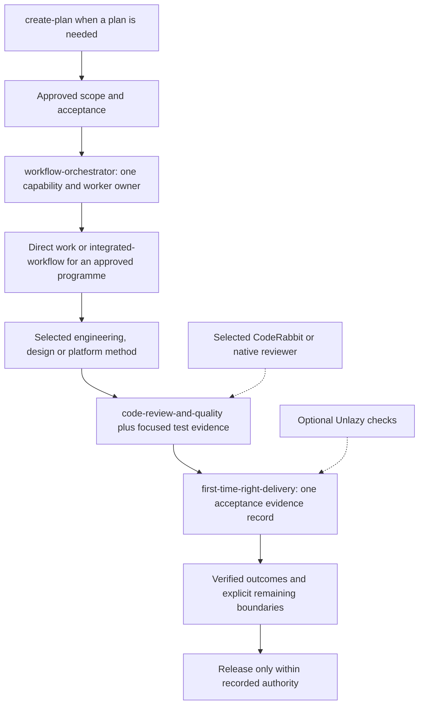
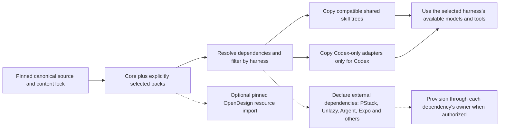
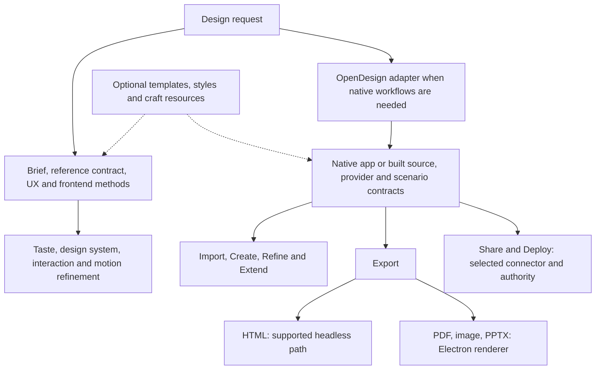

# Rogemar Agent Toolkit

Shared agent methods with native harness adapters. A fresh environment receives a six-skill core; engineering, design and platform packs are optional. The source tree retains every canonical skill and its provenance. An installation exposes only its selected compatible skills.

Source: [digitalpilipinas/rogemar-agent-toolkit](https://github.com/digitalpilipinas/rogemar-agent-toolkit). The repository is public; bundled licenses and third-party notices still apply.

This README describes its selected Git revision. Pending changes appear on their PR branch; GitHub's default `main` page changes only after merge.

## Table of contents

- [Workflow ownership](#workflow-ownership)
- [Optional Unlazy completion checks](#optional-unlazy-completion-checks)
- [Install and choose packs](#install-and-choose-packs)
- [OpenDesign](#opendesign)
- [Updates and duplicate reconciliation](#updates-and-duplicate-reconciliation)
- [Upstream sources](#upstream-sources)
- [Complete skill inventory](#complete-skill-inventory)
- [Pack membership](#pack-membership)
- [Pack dependencies](#pack-dependencies)
- [External and runtime-managed skill groups](#external-and-runtime-managed-skill-groups)
- [Validation and releases](#validation-and-releases)

## Workflow ownership

| Workflow | Shared owner | Native boundary |
| --- | --- | --- |
| Planning | `create-plan` | Repository-grounded scope, acceptance and proportional sequencing; no mandatory model matrix or board |
| Coordination | `workflow-orchestrator` | One delegation owner; use the active harness's exposed controls |
| Engineering | `engineering-playbooks` (23 methods) | Complete Codex Forge in Codex; PStack in Cursor; shared methods elsewhere |
| Approved programme | `integrated-workflow` | Reuse the approved plan and its actual gates |
| Completion evidence | `first-time-right-delivery` | Optional `unlazy` checker uses the same acceptance record; no second coordinator or automatic hook |
| Independent review | `code-review-and-quality` | Five axes; `code-review-tests` supplies focused evidence; CodeRabbit and native reviewers remain separate providers |
| Design | `design-brief`, `reference-design-contract`, `frontend-design` and existing UI/UX helpers | Taste, polish and motion methods are integrated under existing owners |
| OpenDesign application | `opendesign` | All seven native lanes; app, scenarios, providers, renderers and connectors remain native |
| Platform work | Optional web, mobile, Argent, Expo, iOS, Android and security packs | A skill can be useful without an MCP; live actions need the matching runtime |



The core is `workflow-orchestrator`, `create-plan`, `first-time-right-delivery`, `bug-triage`, `code-review-and-quality`, and `code-review-tests`.

Planning and review consolidation evidence is in [methods-review.md](docs/methods-review.md). Design attribution and choices are in [design-integration.md](docs/design-integration.md). Runtime evidence limits and paths are in [compatibility.md](docs/compatibility.md).

## Optional Unlazy completion checks

Link [Unlazy](https://github.com/Leonxlnx/unlazy) as completion support when requested or when substantial work risks omitted outcomes. `first-time-right-delivery` owns the acceptance evidence; `integrated-workflow` owns programme execution. Unlazy checks that same record and helps measure report claims. It is an optional external dependency in the engineering pack, so the six-skill core stays small.

Use the [shared integration contract](plugins/rogemar-agent-toolkit/skills/first-time-right-delivery/references/unlazy.md) from either delivery skill. It preserves one plan, one gate record and one orchestrator. Required gates cannot become passed merely because they were abandoned. Version 2.0 and upstream 2.1 source have different checker behavior; inspect the installed version before selecting execution or re-verification flags. No Unlazy upgrade, hook or persistent harness setting is applied by the toolkit installer.

## Install and choose packs

Use Python 3.9+ and a pinned toolkit checkout. Replace `REVIEWED_COMMIT` below with the exact commit from your approved PR or release. Installation does not call provider APIs, authenticate, start applications or install external dependencies.

```bash
git clone https://github.com/digitalpilipinas/rogemar-agent-toolkit.git
cd rogemar-agent-toolkit
git checkout --detach REVIEWED_COMMIT
python3 scripts/toolkit.py verify
python3 scripts/toolkit.py select --harness codex --pack engineering --pack design
python3 scripts/toolkit.py install --harness codex --target project --project-root /path/to/project
```

The last command installs the core only. To include optional packs, repeat `--pack`:

```bash
python3 scripts/toolkit.py install --harness codex --target project --project-root /path/to/project --pack engineering --pack design --pack opendesign
python3 scripts/toolkit.py install --harness gemini --target project --project-root /path/to/project --pack engineering
```

Use `--target user` for personal installation. The `agent-skills` and Codex portable layouts use `.agents/skills`; Codex-specific entries use `.codex/skills`. Other harnesses use the layout recorded in the catalog. Choose one primary shared installation per project/home; do not install the same pack through a plugin and personal directories simultaneously. Existing installations preserve their profile and pack selection on upgrade. `--profile all` is an explicit full selection, still filtered by harness. Development-only `--link` installs are not portable VM images.

The generated [pack membership table](#pack-membership) lists every pack and its complete direct skill membership. The [dependency table](#pack-dependencies) includes full Expo and Argent member lists, native installation routes, OpenDesign resources and runtime requirements. These tables use the catalog directly, so adding a dependency cannot silently omit it from the README.



`select` prints the exact skills, incompatible exclusions and dependency installation routes. External dependencies are declarations, not automatically installed capabilities. For Expo, prefer its official plugin in Codex; the current [Expo instructions](https://github.com/expo/skills) also support a skills-only installation for other harnesses. Argent's pack records all 16 skills. SDKs, device virtualization, browser control and accounts remain environment prerequisites.

For a Codex marketplace install, build and extract the selected **Codex marketplace archive**, then register that extracted directory using the current Codex plugin commands. A default archive exposes only core. Registering the full source repository directly exposes its entire canonical tree and is appropriate only for an explicit full installation. Start a fresh task to verify discovery after any installation.

## OpenDesign

Choose `design` for portable methods, `opendesign` for full app workflows, and `opendesign-library` for the optional resource library. They can be combined. The full adapter preserves native Import, Create, Export, Share, Deploy, Refine and Extend behavior, including scenario binding, critique state and admission checks.

The application dependency is pinned to OpenDesign 0.21.1. Build/install the native app using its source instructions; its Node, pnpm, native SQLite/PTY/media packages, provider, renderer and connector dependencies are recorded separately. Copying skills does not provision these runtimes. The adapter's doctor is read-only; a real native command is explicit.

```bash
python3 plugins/rogemar-agent-toolkit/skills/opendesign/scripts/opendesign_adapter.py --root /path/to/built-open-design doctor
python3 scripts/toolkit.py resources --source /path/to/open-design --destination /path/to/design-library --dry-run
python3 scripts/toolkit.py resources --source /path/to/open-design --destination /path/to/design-library
```

The resource command reads the pinned commit's complete `design-templates/`, `design-systems/`, `craft/`, and license files. It copies no user database, credentials or untracked files. Resources remain outside skill discovery. Point native OpenDesign to these resources through its supported configuration, or load a selected complete template/style directly for portable work. The source revision must already be available locally; the command never fetches or installs an app.

Headless HTML/project workflows are source-supported. PDF/image/PPTX need Electron's renderer; the bare daemon cannot provide them. Docker additionally needs separately provisioned agent CLIs and template resources. Fresh cloud/provider runs remain separate runtime verification. See [the full runtime matrix](plugins/rogemar-agent-toolkit/skills/opendesign/references/application-workflows.md).



## Updates and duplicate reconciliation

Keep one canonical copy in this repository. Same names are not proof of duplicates: compare complete skill trees, provenance, target and dependencies. Native PStack and Codex Forge remain intentional adapters. Do not remove platform-owned skills or cache versions as a side effect of a shared update.

```bash
python3 scripts/toolkit.py upgrade --harness codex --target user --dry-run
python3 scripts/toolkit.py upgrade --harness codex --target user
python3 scripts/toolkit.py rollback --harness codex --target user
```

Unmanaged collisions and edited managed copies stop an install. `--adopt-identical` adopts only exact trees. After reviewing differing copies, `--backup-conflicts` explicitly permits replacement while retaining the original. Reducing a selection moves former managed skills into the same recoverable backup. Rollback restores content and managed state; displaced newer content is also retained. Legacy installation state requires an explicit harness choice.

Migration across two discovery roots requires first comparing their contents and ownership; the installer does not silently delete a second copy. Project-specific overlays and runtime-owned skill directories remain outside global consolidation.

## Upstream sources

Preserve each source's license and notices. Runtime packages are inventoried separately from redistributable methods. Mutable upstream installs do not update this toolkit's content lock.

- [openai-plugins](https://github.com/openai/plugins) — Use the current Codex built-in marketplace
- [supabase-agent-skills](https://github.com/supabase/agent-skills) — npx skills add supabase/agent-skills
- [coderabbit-skills](https://github.com/coderabbitai/skills) — npx skills add coderabbitai/skills
- [argent](https://github.com/software-mansion/argent) — npx @swmansion/argent@latest init --local
- [unlazy](https://github.com/Leonxlnx/unlazy) — npx skills add Leonxlnx/unlazy
- [pstack](https://github.com/cursor/plugins/tree/main/pstack) — /add-plugin pstack
- [goalbuddy](https://github.com/tolibear/goalbuddy) — npx goalbuddy@latest
- [remotion-skills](https://github.com/remotion-dev/skills) — npx skills add remotion-dev/skills
- [vercel-agent-skills](https://github.com/vercel-labs/agent-skills) — npx skills add vercel-labs/agent-skills --skill vercel-deploy
- [cursor-plugins](https://github.com/cursor/plugins) — Use the Cursor plugin marketplace or the built-in runtime
- [chrome-devtools-mcp](https://github.com/ChromeDevTools/chrome-devtools-mcp) — Follow the Chrome DevTools MCP repository's installation instructions
- [modern-web-guidance](https://github.com/GoogleChrome/modern-web-guidance) — Follow the repository's documented Gemini/Antigravity installation
- [science-skills](https://github.com/google-deepmind/science-skills) — Follow the repository's documented installation
- [exa-grok-plugin](https://github.com/exa-labs/exa-grok-plugin) — Follow the repository's Grok Build installation
- [firecrawl-grok-plugin](https://github.com/firecrawl/firecrawl-grok-plugin) — Follow the repository's Grok Build installation
- [plugin-grok](https://github.com/getsentry/plugin-grok) — Follow the repository's Grok Build installation
- [superpowers](https://github.com/obra/superpowers) — Follow the repository's documented installation
- [vercel-plugin](https://github.com/vercel/vercel-plugin) — Follow the repository's Grok Build installation
- [junie](https://github.com/JetBrains/junie) — Install Junie through JetBrains
- [codex-router](https://github.com/duolahypercho/codex-router) — Follow the repository's documented installation
- [open-design](https://github.com/digitalpilipinas/open-design) — Use the upstream application/source setup instructions; review before moving the pinned resource revision.
- [expo-skills](https://github.com/expo/skills) — npx skills add expo/skills

## Complete skill inventory

This index covers canonical sources, including target-specific entries and external/runtime observations. It is not a claim that every capability is active in a fresh environment. Use `select` to inspect an installation.

<!-- BEGIN GENERATED SKILL INVENTORY -->
<!-- This section is generated by scripts/inventory_readme.py; edit the catalog or SKILL.md instead. -->
Catalog coverage: **103 canonical skills**, **19 packs**, **15 dependency records**, **21 external groups**, **6 runtime records**, and **25 plugin package records**. These counts describe different units and must not be added as a unique skill total.

### Pack membership

Direct members are listed in full; the installer also resolves required skill dependencies and filters native targets. A skill can belong to several packs. External dependencies are declared, not installed.

| Pack | Purpose | Canonical skill members | External dependencies |
| --- | --- | --- | --- |
| `android` | Android build and QA dependencies; local or remotely reachable device runtime required. | `mobile-release-manager` | [argent](#dependency-argent)<br>[android-toolchain](#dependency-android-toolchain) |
| `argent` | The complete 16-skill Argent family, installed and updated by its owner. | None; dependency-only pack | [argent](#dependency-argent) |
| `codex` | Codex-specific model routing and capability maintenance. | `codex-capability-maintainer`<br>`plan-model-router`<br>`hatch-pet` | None |
| `compatibility` | Legacy entry points and optional project/connector helpers; not default routing owners. | `deliver-approved-programme`<br>`dream-team`<br>`project-learning`<br>`figma`<br>`linear` | [coderabbit](#dependency-coderabbit) |
| `content` | Writing, documents, media and publishing preparation. | `article-creator-2`<br>`meeting-notes-task-extractor`<br>`pdf`<br>`seo-content-strategy`<br>`social-content-factory`<br>`sora`<br>`speech`<br>`transcribe` | None |
| `core` | Six shared owners for planning, execution discipline, diagnosis and review. | `workflow-orchestrator`<br>`create-plan`<br>`first-time-right-delivery`<br>`bug-triage`<br>`code-review-and-quality`<br>`code-review-tests` | None |
| `data` | Database and data-analysis helpers. | `supabase`<br>`supabase-guardian`<br>`csv-analytics-reporter` | [supabase](#dependency-supabase)<br>[convex](#dependency-convex) |
| `design` | Design brief, reference fidelity, UI/UX, frontend implementation, Taste, polish, motion and visual verification. | `design-brief`<br>`reference-design-contract`<br>`frontend-design`<br>`ux-flow-architect`<br>`design-system-steward`<br>`interaction-polish`<br>`motion-animation-engineer`<br>`accessibility-auditor`<br>`visual-qa`<br>`vector-asset-pipeline` | None |
| `engineering` | All 23 shared engineering playbooks, approved delivery, testing and performance; native Forge for Codex or PStack for Cursor. | <details><summary>50 members</summary><code>engineering-playbooks</code><br><code>integrated-workflow</code><br><code>test-architecture-engineer</code><br><code>performance-profiler</code><br><code>agent-map</code><br><code>codex-forge</code><br><code>forge-architect</code><br><code>forge-arena</code><br><code>forge-automate-me</code><br><code>forge-blast-radius</code><br><code>forge-bro</code><br><code>forge-create-verification-skill</code><br><code>forge-figure-it-out</code><br><code>forge-how</code><br><code>forge-interrogate</code><br><code>forge-maintain-verification-skill</code><br><code>forge-make-bot-ui</code><br><code>forge-no-comments</code><br><code>forge-principle-boundary-discipline</code><br><code>forge-principle-build-the-lever</code><br><code>forge-principle-encode-lessons-in-structure</code><br><code>forge-principle-exhaust-the-design-space</code><br><code>forge-principle-experience-first</code><br><code>forge-principle-fix-root-causes</code><br><code>forge-principle-foundational-thinking</code><br><code>forge-principle-guard-the-context-window</code><br><code>forge-principle-laziness-protocol</code><br><code>forge-principle-make-operations-idempotent</code><br><code>forge-principle-migrate-callers-then-delete-legacy-apis</code><br><code>forge-principle-minimize-reader-load</code><br><code>forge-principle-model-the-domain</code><br><code>forge-principle-never-block-on-the-human</code><br><code>forge-principle-outcome-oriented-execution</code><br><code>forge-principle-prove-it-works</code><br><code>forge-principle-redesign-from-first-principles</code><br><code>forge-principle-separate-before-serializing-shared-state</code><br><code>forge-principle-sequence-verifiable-units</code><br><code>forge-principle-subtract-before-you-add</code><br><code>forge-principle-type-system-discipline</code><br><code>forge-recall</code><br><code>forge-reflect</code><br><code>forge-setup</code><br><code>forge-show-me-your-work</code><br><code>forge-swarm</code><br><code>forge-tdd</code><br><code>forge-teach</code><br><code>forge-technical-writing</code><br><code>forge-typescript-best-practices</code><br><code>forge-unslop</code><br><code>forge-why</code></details> | [pstack](#dependency-pstack)<br>[unlazy](#dependency-unlazy) |
| `expo` | Expo skills including routing, builds, deployment, native UI and upgrades. | None; dependency-only pack | [expo](#dependency-expo) |
| `external-agents` | Explicitly authorized external provider coordination. | `agent-collaboration-terminal` | [external-providers](#dependency-external-providers) |
| `ios` | iOS build and QA dependencies; macOS/Xcode are required for local simulators. | `mobile-release-manager` | [argent](#dependency-argent)<br>[ios-toolchain](#dependency-ios-toolchain) |
| `mobile` | Cross-platform lifecycle and data compatibility; choose runtime packs for actual device evidence. | `mobile-release-manager`<br>`offline-sync-auditor`<br>`activity-schema-guardian` | [argent](#dependency-argent) |
| `opendesign` | Full native OpenDesign workflow adapter with app and lane dependencies. | `opendesign`<br>`design-brief`<br>`reference-design-contract`<br>`frontend-design` | [opendesign-runtime](#dependency-opendesign-runtime) |
| `opendesign-library` | Optional pinned templates, style systems and craft references; imported as resources, not hundreds of global triggers. | None; dependency-only pack | [opendesign-library](#dependency-opendesign-library) |
| `release` | Release planning and host-specific deployment adapters. | `deploy-checklist`<br>`gh-address-comments`<br>`gh-fix-ci`<br>`cloudflare-deploy`<br>`netlify-deploy`<br>`vercel-deploy` | [hosting-clis](#dependency-hosting-clis) |
| `research` | Source-grounded research and knowledge synthesis. | `research-synthesizer`<br>`knowledge-base-answering` | None |
| `security` | Portable security and privacy review, with optional separate Codex Security provider. | `security-best-practices`<br>`privacy-safety-review` | [codex-security](#dependency-codex-security) |
| `web` | Browser verification and web implementation helpers. | `playwright`<br>`screenshot`<br>`develop-web-game`<br>`accessibility-auditor`<br>`visual-qa` | [browser-control](#dependency-browser-control) |

### Canonical skills (103)

| Skill | Purpose | Targets | Declared author / provenance | Source and upstream | License / redistribution |
| --- | --- | --- | --- | --- | --- |
| [`accessibility-auditor`](plugins/rogemar-agent-toolkit/skills/accessibility-auditor/SKILL.md) | Use for accessibility reviews or implementation involving semantic structure, keyboard and focus behavior, screen readers, ARIA, live announcements, contrast, touch targets, Dynamic Type, reduced motion, forms, errors, and automated plus manual a11y evidence. | portable | Source author not declared; snapshot maintained by Rogemar | [SKILL.md](plugins/rogemar-agent-toolkit/skills/accessibility-auditor/SKILL.md) | Not declared in snapshot; review before redistribution |
| [`activity-schema-guardian`](plugins/rogemar-agent-toolkit/skills/activity-schema-guardian/SKILL.md) | Use for activity, event, telemetry, logging, or domain schema work involving canonical IDs, category discriminators, sport/activity-specific fields, fixtures, aliases, backward compatibility, JSONB or flexible payload validation, database migrations, and derived insight metrics. | portable | Source author not declared; snapshot maintained by Rogemar | [SKILL.md](plugins/rogemar-agent-toolkit/skills/activity-schema-guardian/SKILL.md) | Not declared in snapshot; review before redistribution |
| [`agent-collaboration-terminal`](plugins/rogemar-agent-toolkit/skills/agent-collaboration-terminal/SKILL.md) | Coordinate native Grok, Antigravity/Gemini, Cursor Agent, Junie, and Codex CLI sessions from Codex for research, planning, implementation, review, validation, or other bounded external-agent work. Prepare exact worktree prompts, Codex-managed PTY or background execution with physical fallback, frozen repository fingerprints, Markdown artifacts, monitoring, handoffs, and Codex synthesis without routing through the Agent Collaboration MCP broker. | codex | Source author not declared; snapshot maintained by Rogemar | [SKILL.md](plugins/rogemar-agent-toolkit/skills/agent-collaboration-terminal/SKILL.md) | Not declared in snapshot; review before redistribution |
| [`agent-map`](plugins/rogemar-agent-toolkit/skills/agent-map/SKILL.md) | Use a local, on-demand repository map to reduce exploratory file reads and token use during unfamiliar-code, architecture, multi-file refactor, branch, and commit tasks. Build incremental metadata-only indexes, locate likely files/symbols/callers, check freshness, and fall back to direct search when the map is stale or incomplete. Do not use for known-file edits or simple one-file tasks. | portable | Source author not declared; snapshot maintained by Rogemar | [SKILL.md](plugins/rogemar-agent-toolkit/skills/agent-map/SKILL.md) | Not declared in snapshot; review before redistribution |
| [`article-creator-2`](plugins/rogemar-agent-toolkit/skills/article-creator-2/SKILL.md) | Use when creating researched long-form content, blog posts, documentation pages, product landing pages, or article packages that need source-backed research, an outline, polished HTML/Markdown, visual direction or generated images, and optional PDF/export preparation. | portable | Source author not declared; snapshot maintained by Rogemar | [SKILL.md](plugins/rogemar-agent-toolkit/skills/article-creator-2/SKILL.md) | Not declared in snapshot; review before redistribution |
| [`bug-triage`](plugins/rogemar-agent-toolkit/skills/bug-triage/SKILL.md) | Use when investigating errors, logs, failed tests, crashes, CI failures, production incidents, bug reports, or confusing runtime behavior that needs hypotheses, reproduction steps, and prioritized fixes. | portable | Source author not declared; snapshot maintained by Rogemar | [SKILL.md](plugins/rogemar-agent-toolkit/skills/bug-triage/SKILL.md) | Not declared in snapshot; review before redistribution |
| [`cloudflare-deploy`](plugins/rogemar-agent-toolkit/skills/cloudflare-deploy/SKILL.md) | Deploy applications and infrastructure to Cloudflare using Workers, Pages, and related platform services. Use when the user asks to deploy, host, publish, or set up a project on Cloudflare. | portable | Source author not declared; snapshot maintained by Rogemar | [SKILL.md](plugins/rogemar-agent-toolkit/skills/cloudflare-deploy/SKILL.md) | Evidence: `LICENSE.txt`; review terms before redistribution |
| [`code-review-and-quality`](plugins/rogemar-agent-toolkit/skills/code-review-and-quality/SKILL.md) | Review a code change across correctness, readability, architecture, security, and performance. Use for an independent review, quality assessment, or reconciliation of reviewer findings; own one evidence-based verdict while native reviewers and CodeRabbit remain optional provider routes. | portable | Source author not declared; snapshot maintained by Rogemar | [SKILL.md](plugins/rogemar-agent-toolkit/skills/code-review-and-quality/SKILL.md) | Not declared in snapshot; review before redistribution |
| [`code-review-tests`](plugins/rogemar-agent-toolkit/skills/code-review-tests/SKILL.md) | Check a change's test evidence, regression coverage, and relevant counterexamples. Use as the testing lens within one code review or for a focused verification review; contribute findings without starting a duplicate quality review. | portable | Source author not declared; snapshot maintained by Rogemar | [SKILL.md](plugins/rogemar-agent-toolkit/skills/code-review-tests/SKILL.md) | Not declared in snapshot; review before redistribution |
| [`codex-capability-maintainer`](plugins/rogemar-agent-toolkit/skills/codex-capability-maintainer/SKILL.md) | Use when auditing, adding, updating, or troubleshooting Codex skills, MCP servers, plugins, connectors, automations, hooks, AGENTS.md, global config, or secret-safe local agent capabilities. | codex | Source author not declared; snapshot maintained by Rogemar | [SKILL.md](plugins/rogemar-agent-toolkit/skills/codex-capability-maintainer/SKILL.md) | Not declared in snapshot; review before redistribution |
| [`codex-forge`](plugins/rogemar-agent-toolkit/skills/codex-forge/SKILL.md) | Execute rigorous coding tasks with the full Forge engineering skill and playbook family. Use for Codex Forge, substantive implementation, diagnosis, refactoring, review, verification, or approved programme execution. Integrates with workflow-orchestrator and task-based Codex model routing. | codex | Lauren Tan; Codex adaptation by Rogemar | [SKILL.md](plugins/rogemar-agent-toolkit/skills/codex-forge/SKILL.md); [upstream](https://github.com/cursor/plugins/tree/93b00b89ef425a9c1bac0d0b317dfc49c930ac99/pstack) | Evidence: `LICENSE.txt`; review terms before redistribution |
| [`create-plan`](plugins/rogemar-agent-toolkit/skills/create-plan/SKILL.md) | Plan a software change from repository evidence, clear scope, practical increments, and observable acceptance. Use for an explicit planning request or when non-trivial work needs sequencing; keep routine changes brief and leave model selection to the active harness. | portable | Source author not declared; snapshot maintained by Rogemar | [SKILL.md](plugins/rogemar-agent-toolkit/skills/create-plan/SKILL.md) | Evidence: `LICENSE.txt`; review terms before redistribution |
| [`csv-analytics-reporter`](plugins/rogemar-agent-toolkit/skills/csv-analytics-reporter/SKILL.md) | Use when analyzing CSV, TSV, spreadsheet exports, product analytics, finance tables, survey responses, event logs, or tabular data that needs cleaning, aggregation, charts, anomaly checks, or plain-language findings. | portable | Source author not declared; snapshot maintained by Rogemar | [SKILL.md](plugins/rogemar-agent-toolkit/skills/csv-analytics-reporter/SKILL.md) | Not declared in snapshot; review before redistribution |
| [`deliver-approved-programme`](plugins/rogemar-agent-toolkit/skills/deliver-approved-programme/SKILL.md) | Compatibility entry for prompts that explicitly name deliver-approved-programme. The maintained workflow is integrated-workflow; use that name for new approved implementation and delivery tasks. | portable | Source author not declared; snapshot maintained by Rogemar | [SKILL.md](plugins/rogemar-agent-toolkit/skills/deliver-approved-programme/SKILL.md) | Not declared in snapshot; review before redistribution |
| [`deploy-checklist`](plugins/rogemar-agent-toolkit/skills/deploy-checklist/SKILL.md) | Use when preparing releases, deploys, preview builds, production pushes, branch summaries, release notes, rollback plans, QA checklists, or risk reviews before shipping a web, mobile, backend, or Supabase change. | portable | Source author not declared; snapshot maintained by Rogemar | [SKILL.md](plugins/rogemar-agent-toolkit/skills/deploy-checklist/SKILL.md) | Not declared in snapshot; review before redistribution |
| [`design-brief`](plugins/rogemar-agent-toolkit/skills/design-brief/SKILL.md) | Turn natural-language or structured design input into a concise buildable brief with audience, visual dimensions, constraints and acceptance evidence. Use before design work when the desired direction is ambiguous; do not restart an already settled product brief. | portable | Rogemar; upstream notices preserved | [SKILL.md](plugins/rogemar-agent-toolkit/skills/design-brief/SKILL.md); [upstream](https://github.com/digitalpilipinas/open-design) | Evidence: `LICENSE.txt`; review terms before redistribution |
| [`design-system-steward`](plugins/rogemar-agent-toolkit/skills/design-system-steward/SKILL.md) | Use for design-system work involving themes, tokens, components, typography, spacing, icons, dark and light modes, accessibility, reusable UI primitives, visual consistency, and aligning new screens with an existing product language across web or mobile apps. | portable | Source author not declared; snapshot maintained by Rogemar | [SKILL.md](plugins/rogemar-agent-toolkit/skills/design-system-steward/SKILL.md) | Not declared in snapshot; review before redistribution |
| [`develop-web-game`](plugins/rogemar-agent-toolkit/skills/develop-web-game/SKILL.md) | Use when Codex is building or iterating on a web game (HTML/JS) and needs a reliable development + testing loop: implement small changes, run a Playwright-based test script with short input bursts and intentional pauses, inspect screenshots/text, and review console errors with render_game_to_text. | portable | Source author not declared; snapshot maintained by Rogemar | [SKILL.md](plugins/rogemar-agent-toolkit/skills/develop-web-game/SKILL.md) | Evidence: `LICENSE.txt`; review terms before redistribution |
| [`dream-team`](plugins/rogemar-agent-toolkit/skills/dream-team/SKILL.md) | Use for Rogemar's optional persona-based routing and explanation layer across coding projects. Trigger when the user asks for Dream Team help, names a Dream Team persona or squad, requests plain-language translation, or wants coordinated planning, design, implementation, review, or release guidance. | portable | Source author not declared; snapshot maintained by Rogemar | [SKILL.md](plugins/rogemar-agent-toolkit/skills/dream-team/SKILL.md) | Not declared in snapshot; review before redistribution |
| [`engineering-playbooks`](plugins/rogemar-agent-toolkit/skills/engineering-playbooks/SKILL.md) | Apply a reusable engineering playbook for features, bug fixes, investigation, refactoring, performance, experiments, phased delivery, PR stacks, or session recovery across agent harnesses. Select one matching method; keep model and tool routing with the active harness. | portable | Rogemar; upstream notices preserved | [SKILL.md](plugins/rogemar-agent-toolkit/skills/engineering-playbooks/SKILL.md); [upstream](https://github.com/cursor/plugins/tree/93b00b89ef425a9c1bac0d0b317dfc49c930ac99/pstack) | Evidence: `LICENSE.txt`; review terms before redistribution |
| [`figma`](plugins/rogemar-agent-toolkit/skills/figma/SKILL.md) | Use the Figma MCP server to fetch design context, screenshots, variables, and assets from Figma, and to translate Figma nodes into production code. Trigger when a task involves Figma URLs, node IDs, design-to-code implementation, or Figma MCP setup and troubleshooting. | portable | Source author not declared; snapshot maintained by Rogemar | [SKILL.md](plugins/rogemar-agent-toolkit/skills/figma/SKILL.md) | Evidence: `LICENSE.txt`; review terms before redistribution |
| [`first-time-right-delivery`](plugins/rogemar-agent-toolkit/skills/first-time-right-delivery/SKILL.md) | Keep requirements, implementation, and acceptance evidence aligned during a non-trivial software change. Use when missed behavior, compatibility, or premature readiness claims are a material risk; supplement the current plan and review without creating another workflow. | portable | Source author not declared; snapshot maintained by Rogemar | [SKILL.md](plugins/rogemar-agent-toolkit/skills/first-time-right-delivery/SKILL.md) | Not declared in snapshot; review before redistribution |
| [`forge-architect`](plugins/rogemar-agent-toolkit/skills/forge-architect/SKILL.md) | Sketch types, signatures, and module structure before code, then stay in the loop while implementation fills in. Use for $forge-architect, 'architect this', 'design this', or non-trivial work where jumping to code would lock in the wrong shape. | codex | Lauren Tan; Codex adaptation by Rogemar | [SKILL.md](plugins/rogemar-agent-toolkit/skills/forge-architect/SKILL.md); [upstream](https://github.com/cursor/plugins/tree/93b00b89ef425a9c1bac0d0b317dfc49c930ac99/pstack) | Evidence: `LICENSE.txt`; review terms before redistribution |
| [`forge-arena`](plugins/rogemar-agent-toolkit/skills/forge-arena/SKILL.md) | Compare independent candidates against a rubric, choose a base, graft useful ideas and verify one synthesis. Request bounded collaboration through workflow-orchestrator. | codex | Lauren Tan; Codex adaptation by Rogemar | [SKILL.md](plugins/rogemar-agent-toolkit/skills/forge-arena/SKILL.md); [upstream](https://github.com/cursor/plugins/tree/93b00b89ef425a9c1bac0d0b317dfc49c930ac99/pstack) | Evidence: `LICENSE.txt`; review terms before redistribution |
| [`forge-automate-me`](plugins/rogemar-agent-toolkit/skills/forge-automate-me/SKILL.md) | Use for \"automate me\", \"create/update/refresh my -mode skill\", \"turn/capture my preferences or working style into a skill\", or wanting agents to follow how the user works. Drafts or revises a personal -mode skill via create-skill + unslop, optionally pulling fresh evidence from recent transcripts. | codex | Lauren Tan; Codex adaptation by Rogemar | [SKILL.md](plugins/rogemar-agent-toolkit/skills/forge-automate-me/SKILL.md); [upstream](https://github.com/cursor/plugins/tree/93b00b89ef425a9c1bac0d0b317dfc49c930ac99/pstack) | Evidence: `LICENSE.txt`; review terms before redistribution |
| [`forge-blast-radius`](plugins/rogemar-agent-toolkit/skills/forge-blast-radius/SKILL.md) | Find what a change could break somewhere else before it ships, beyond the diff, and prove the one fact it's safe because of by running real code instead of writing it up. Use for 'blast radius of X', 'what could this break', or reviewing a small diff you don't trust. | codex | Lauren Tan; Codex adaptation by Rogemar | [SKILL.md](plugins/rogemar-agent-toolkit/skills/forge-blast-radius/SKILL.md); [upstream](https://github.com/cursor/plugins/tree/93b00b89ef425a9c1bac0d0b317dfc49c930ac99/pstack) | Evidence: `LICENSE.txt`; review terms before redistribution |
| [`forge-bro`](plugins/rogemar-agent-toolkit/skills/forge-bro/SKILL.md) | Restate the last message in plain human language, with no jargon. | codex | Lauren Tan; Codex adaptation by Rogemar | [SKILL.md](plugins/rogemar-agent-toolkit/skills/forge-bro/SKILL.md); [upstream](https://github.com/cursor/plugins/tree/93b00b89ef425a9c1bac0d0b317dfc49c930ac99/pstack) | Evidence: `LICENSE.txt`; review terms before redistribution |
| [`forge-create-verification-skill`](plugins/rogemar-agent-toolkit/skills/forge-create-verification-skill/SKILL.md) | Generate a project-local verification skill that drives your app the way a user does — any language, framework, or platform. Use for $forge-create-verification-skill, \"make a control skill for this repo\", or when a project has no scripted way to prove UI/CLI/service behavior. | codex | Lauren Tan; Codex adaptation by Rogemar | [SKILL.md](plugins/rogemar-agent-toolkit/skills/forge-create-verification-skill/SKILL.md); [upstream](https://github.com/cursor/plugins/tree/93b00b89ef425a9c1bac0d0b317dfc49c930ac99/pstack) | Evidence: `LICENSE.txt`; review terms before redistribution |
| [`forge-figure-it-out`](plugins/rogemar-agent-toolkit/skills/forge-figure-it-out/SKILL.md) | Design an auditable playbook when no narrower one fits: a large migration, an ambitious multi-part change, or work a human reviews after stepping away. Scales rigor to the task, runs a hypothesis loop, and logs decisions via forge-show-me-your-work. Use for $forge-figure-it-out, 'figure it out', a large migration, or when no narrower playbook applies. | codex | Lauren Tan; Codex adaptation by Rogemar | [SKILL.md](plugins/rogemar-agent-toolkit/skills/forge-figure-it-out/SKILL.md); [upstream](https://github.com/cursor/plugins/tree/93b00b89ef425a9c1bac0d0b317dfc49c930ac99/pstack) | Evidence: `LICENSE.txt`; review terms before redistribution |
| [`forge-how`](plugins/rogemar-agent-toolkit/skills/forge-how/SKILL.md) | Use for \"how does X work\", code walkthroughs before changing something, and placement / ownership / layering questions (\"where should this live\", \"which package owns this\", \"is this the right layer\"). Explains subsystem architecture, runtime flow, onboarding mental models. Can critique architecture. Use why for motivation. | codex | Lauren Tan; Codex adaptation by Rogemar | [SKILL.md](plugins/rogemar-agent-toolkit/skills/forge-how/SKILL.md); [upstream](https://github.com/cursor/plugins/tree/93b00b89ef425a9c1bac0d0b317dfc49c930ac99/pstack) | Evidence: `LICENSE.txt`; review terms before redistribution |
| [`forge-interrogate`](plugins/rogemar-agent-toolkit/skills/forge-interrogate/SKILL.md) | Use for \"interrogate\", \"adversarial review\", \"multi-model review\", \"challenge this\", \"stress test this code\", \"find blind spots\", or \"tear this apart\". Multiple LLM reviewers challenge changes from independent angles. | codex | Lauren Tan; Codex adaptation by Rogemar | [SKILL.md](plugins/rogemar-agent-toolkit/skills/forge-interrogate/SKILL.md); [upstream](https://github.com/cursor/plugins/tree/93b00b89ef425a9c1bac0d0b317dfc49c930ac99/pstack) | Evidence: `LICENSE.txt`; review terms before redistribution |
| [`forge-maintain-verification-skill`](plugins/rogemar-agent-toolkit/skills/forge-maintain-verification-skill/SKILL.md) | Periodic pass that keeps a project's verification skill and feature map honest: bounded source inspection and a live coverage pass with proven local corrections. Use for $forge-maintain-verification-skill or \"audit the verify skill\". | codex | Lauren Tan; Codex adaptation by Rogemar | [SKILL.md](plugins/rogemar-agent-toolkit/skills/forge-maintain-verification-skill/SKILL.md); [upstream](https://github.com/cursor/plugins/tree/93b00b89ef425a9c1bac0d0b317dfc49c930ac99/pstack) | Evidence: `LICENSE.txt`; review terms before redistribution |
| [`forge-make-bot-ui`](plugins/rogemar-agent-toolkit/skills/forge-make-bot-ui/SKILL.md) | Design and build a page or dashboard that triggers an authorized bot through a verified webhook adapter. Use for bot buttons, webhook dashboards, and private network access; gate execution when Codex lacks the necessary live service or secure credential entry. | codex | Lauren Tan; Codex adaptation by Rogemar | [SKILL.md](plugins/rogemar-agent-toolkit/skills/forge-make-bot-ui/SKILL.md); [upstream](https://github.com/cursor/plugins/tree/93b00b89ef425a9c1bac0d0b317dfc49c930ac99/pstack) | Evidence: `LICENSE.txt`; review terms before redistribution |
| [`forge-no-comments`](plugins/rogemar-agent-toolkit/skills/forge-no-comments/SKILL.md) | Review code comments and suppressions for noise, obsolete explanations, and opportunities to encode constraints. Use for comment cleanup or a focused review; preserve unresolved safety and compatibility requirements. | codex | Lauren Tan; Codex adaptation by Rogemar | [SKILL.md](plugins/rogemar-agent-toolkit/skills/forge-no-comments/SKILL.md); [upstream](https://github.com/cursor/plugins/tree/93b00b89ef425a9c1bac0d0b317dfc49c930ac99/pstack) | Evidence: `LICENSE.txt`; review terms before redistribution |
| [`forge-principle-boundary-discipline`](plugins/rogemar-agent-toolkit/skills/forge-principle-boundary-discipline/SKILL.md) | Apply when wiring validation, error handling, or framework adapters. Concentrate guards at system boundaries (CLI, config, network, external APIs); trust internal types and keep business logic in pure functions. | codex | Lauren Tan; Codex adaptation by Rogemar | [SKILL.md](plugins/rogemar-agent-toolkit/skills/forge-principle-boundary-discipline/SKILL.md); [upstream](https://github.com/cursor/plugins/tree/93b00b89ef425a9c1bac0d0b317dfc49c930ac99/pstack) | Evidence: `LICENSE.txt`; review terms before redistribution |
| [`forge-principle-build-the-lever`](plugins/rogemar-agent-toolkit/skills/forge-principle-build-the-lever/SKILL.md) | Apply to any non-trivial work, not just bulk work: edits, migrations, analyses, checks. Build the tool that does it or proves it (codemod, script, generator, or a skill your subagents follow) instead of working by hand. The tool is the artifact a reviewer can rerun. | codex | Lauren Tan; Codex adaptation by Rogemar | [SKILL.md](plugins/rogemar-agent-toolkit/skills/forge-principle-build-the-lever/SKILL.md); [upstream](https://github.com/cursor/plugins/tree/93b00b89ef425a9c1bac0d0b317dfc49c930ac99/pstack) | Evidence: `LICENSE.txt`; review terms before redistribution |
| [`forge-principle-encode-lessons-in-structure`](plugins/rogemar-agent-toolkit/skills/forge-principle-encode-lessons-in-structure/SKILL.md) | Apply when you catch yourself writing the same instruction a second time, or notice a recurring correction. Encode the rule as a lint, metadata flag, runtime check, or script instead of more text. | codex | Lauren Tan; Codex adaptation by Rogemar | [SKILL.md](plugins/rogemar-agent-toolkit/skills/forge-principle-encode-lessons-in-structure/SKILL.md); [upstream](https://github.com/cursor/plugins/tree/93b00b89ef425a9c1bac0d0b317dfc49c930ac99/pstack) | Evidence: `LICENSE.txt`; review terms before redistribution |
| [`forge-principle-exhaust-the-design-space`](plugins/rogemar-agent-toolkit/skills/forge-principle-exhaust-the-design-space/SKILL.md) | Apply when facing a novel UI interaction or architectural decision with no precedent in the codebase. Build 2-3 competing prototypes and compare side by side before committing. | codex | Lauren Tan; Codex adaptation by Rogemar | [SKILL.md](plugins/rogemar-agent-toolkit/skills/forge-principle-exhaust-the-design-space/SKILL.md); [upstream](https://github.com/cursor/plugins/tree/93b00b89ef425a9c1bac0d0b317dfc49c930ac99/pstack) | Evidence: `LICENSE.txt`; review terms before redistribution |
| [`forge-principle-experience-first`](plugins/rogemar-agent-toolkit/skills/forge-principle-experience-first/SKILL.md) | Apply when product, UX, or feature-scope tradeoffs come up. Choose user delight over implementation convenience; ship fewer polished features over more rough ones. | codex | Lauren Tan; Codex adaptation by Rogemar | [SKILL.md](plugins/rogemar-agent-toolkit/skills/forge-principle-experience-first/SKILL.md); [upstream](https://github.com/cursor/plugins/tree/93b00b89ef425a9c1bac0d0b317dfc49c930ac99/pstack) | Evidence: `LICENSE.txt`; review terms before redistribution |
| [`forge-principle-fix-root-causes`](plugins/rogemar-agent-toolkit/skills/forge-principle-fix-root-causes/SKILL.md) | Apply when debugging. Trace each symptom to its root cause and fix it there; reproduce first, ask why until you reach it, resist nil-check guards that silence crashes. | codex | Lauren Tan; Codex adaptation by Rogemar | [SKILL.md](plugins/rogemar-agent-toolkit/skills/forge-principle-fix-root-causes/SKILL.md); [upstream](https://github.com/cursor/plugins/tree/93b00b89ef425a9c1bac0d0b317dfc49c930ac99/pstack) | Evidence: `LICENSE.txt`; review terms before redistribution |
| [`forge-principle-foundational-thinking`](plugins/rogemar-agent-toolkit/skills/forge-principle-foundational-thinking/SKILL.md) | Apply before writing logic: choosing core types and data structures, sequencing scaffold-vs-feature work, asking what concurrent actors share. Get the data structures right so downstream code becomes obvious. | codex | Lauren Tan; Codex adaptation by Rogemar | [SKILL.md](plugins/rogemar-agent-toolkit/skills/forge-principle-foundational-thinking/SKILL.md); [upstream](https://github.com/cursor/plugins/tree/93b00b89ef425a9c1bac0d0b317dfc49c930ac99/pstack) | Evidence: `LICENSE.txt`; review terms before redistribution |
| [`forge-principle-guard-the-context-window`](plugins/rogemar-agent-toolkit/skills/forge-principle-guard-the-context-window/SKILL.md) | Apply when context is filling up: large outputs, long files, repeated reads, fan-out planning. Route bulk to subagents; keep summaries in the main thread, not raw payloads. | codex | Lauren Tan; Codex adaptation by Rogemar | [SKILL.md](plugins/rogemar-agent-toolkit/skills/forge-principle-guard-the-context-window/SKILL.md); [upstream](https://github.com/cursor/plugins/tree/93b00b89ef425a9c1bac0d0b317dfc49c930ac99/pstack) | Evidence: `LICENSE.txt`; review terms before redistribution |
| [`forge-principle-laziness-protocol`](plugins/rogemar-agent-toolkit/skills/forge-principle-laziness-protocol/SKILL.md) | Apply when refactoring, evaluating diff size, or tempted to add abstractions, layers, or signal threading. Bias toward deletion and the smallest change that solves the problem. | codex | Lauren Tan; Codex adaptation by Rogemar | [SKILL.md](plugins/rogemar-agent-toolkit/skills/forge-principle-laziness-protocol/SKILL.md); [upstream](https://github.com/cursor/plugins/tree/93b00b89ef425a9c1bac0d0b317dfc49c930ac99/pstack) | Evidence: `LICENSE.txt`; review terms before redistribution |
| [`forge-principle-make-operations-idempotent`](plugins/rogemar-agent-toolkit/skills/forge-principle-make-operations-idempotent/SKILL.md) | Apply when designing commands, lifecycle steps, or processing loops that run amid crashes, restarts, and retries. Converge to the same end state regardless of partial prior runs. | codex | Lauren Tan; Codex adaptation by Rogemar | [SKILL.md](plugins/rogemar-agent-toolkit/skills/forge-principle-make-operations-idempotent/SKILL.md); [upstream](https://github.com/cursor/plugins/tree/93b00b89ef425a9c1bac0d0b317dfc49c930ac99/pstack) | Evidence: `LICENSE.txt`; review terms before redistribution |
| [`forge-principle-migrate-callers-then-delete-legacy-apis`](plugins/rogemar-agent-toolkit/skills/forge-principle-migrate-callers-then-delete-legacy-apis/SKILL.md) | Migrate controlled API callers and remove proven dead paths while preserving supported clients, persisted formats and staged compatibility contracts. | codex | Lauren Tan; Codex adaptation by Rogemar | [SKILL.md](plugins/rogemar-agent-toolkit/skills/forge-principle-migrate-callers-then-delete-legacy-apis/SKILL.md); [upstream](https://github.com/cursor/plugins/tree/93b00b89ef425a9c1bac0d0b317dfc49c930ac99/pstack) | Evidence: `LICENSE.txt`; review terms before redistribution |
| [`forge-principle-minimize-reader-load`](plugins/rogemar-agent-toolkit/skills/forge-principle-minimize-reader-load/SKILL.md) | Apply when reviewing or shaping code that's hard to trace. Count layers between question and answer, and hidden state in the reader's head; collapse one-caller wrappers and shrink mutable scope. | codex | Lauren Tan; Codex adaptation by Rogemar | [SKILL.md](plugins/rogemar-agent-toolkit/skills/forge-principle-minimize-reader-load/SKILL.md); [upstream](https://github.com/cursor/plugins/tree/93b00b89ef425a9c1bac0d0b317dfc49c930ac99/pstack) | Evidence: `LICENSE.txt`; review terms before redistribution |
| [`forge-principle-model-the-domain`](plugins/rogemar-agent-toolkit/skills/forge-principle-model-the-domain/SKILL.md) | Apply when writing stateful logic, or when code branches a lot or repeats a shape assumption across files. Encode the domain in a structure instead of scattered conditionals. | codex | Lauren Tan; Codex adaptation by Rogemar | [SKILL.md](plugins/rogemar-agent-toolkit/skills/forge-principle-model-the-domain/SKILL.md); [upstream](https://github.com/cursor/plugins/tree/93b00b89ef425a9c1bac0d0b317dfc49c930ac99/pstack) | Evidence: `LICENSE.txt`; review terms before redistribution |
| [`forge-principle-never-block-on-the-human`](plugins/rogemar-agent-toolkit/skills/forge-principle-never-block-on-the-human/SKILL.md) | Apply when tempted to ask 'should I do X?' on reversible work. Proceed, present the result, let the human course-correct after the fact; reserve confirmation for irreversible actions. | codex | Lauren Tan; Codex adaptation by Rogemar | [SKILL.md](plugins/rogemar-agent-toolkit/skills/forge-principle-never-block-on-the-human/SKILL.md); [upstream](https://github.com/cursor/plugins/tree/93b00b89ef425a9c1bac0d0b317dfc49c930ac99/pstack) | Evidence: `LICENSE.txt`; review terms before redistribution |
| [`forge-principle-outcome-oriented-execution`](plugins/rogemar-agent-toolkit/skills/forge-principle-outcome-oriented-execution/SKILL.md) | Apply during planned rewrites and migrations with explicit phase boundaries. Converge on the target architecture; don't preserve smooth intermediate states with throwaway compatibility code. | codex | Lauren Tan; Codex adaptation by Rogemar | [SKILL.md](plugins/rogemar-agent-toolkit/skills/forge-principle-outcome-oriented-execution/SKILL.md); [upstream](https://github.com/cursor/plugins/tree/93b00b89ef425a9c1bac0d0b317dfc49c930ac99/pstack) | Evidence: `LICENSE.txt`; review terms before redistribution |
| [`forge-principle-prove-it-works`](plugins/rogemar-agent-toolkit/skills/forge-principle-prove-it-works/SKILL.md) | Apply after completing a task, before declaring done. Verify against the real artifact (run the feature, read the actual value, inspect the diff), not a proxy, self-report, or 'it compiles. | codex | Lauren Tan; Codex adaptation by Rogemar | [SKILL.md](plugins/rogemar-agent-toolkit/skills/forge-principle-prove-it-works/SKILL.md); [upstream](https://github.com/cursor/plugins/tree/93b00b89ef425a9c1bac0d0b317dfc49c930ac99/pstack) | Evidence: `LICENSE.txt`; review terms before redistribution |
| [`forge-principle-redesign-from-first-principles`](plugins/rogemar-agent-toolkit/skills/forge-principle-redesign-from-first-principles/SKILL.md) | Apply when integrating a new requirement into an existing design. Redesign as if the requirement had been a foundational assumption from day one, instead of bolting it on. | codex | Lauren Tan; Codex adaptation by Rogemar | [SKILL.md](plugins/rogemar-agent-toolkit/skills/forge-principle-redesign-from-first-principles/SKILL.md); [upstream](https://github.com/cursor/plugins/tree/93b00b89ef425a9c1bac0d0b317dfc49c930ac99/pstack) | Evidence: `LICENSE.txt`; review terms before redistribution |
| [`forge-principle-separate-before-serializing-shared-state`](plugins/rogemar-agent-toolkit/skills/forge-principle-separate-before-serializing-shared-state/SKILL.md) | Apply when concurrent actors might write to the same file, branch, key, or state object. Eliminate the sharing first; serialize structurally only when one shared writer is a real invariant. | codex | Lauren Tan; Codex adaptation by Rogemar | [SKILL.md](plugins/rogemar-agent-toolkit/skills/forge-principle-separate-before-serializing-shared-state/SKILL.md); [upstream](https://github.com/cursor/plugins/tree/93b00b89ef425a9c1bac0d0b317dfc49c930ac99/pstack) | Evidence: `LICENSE.txt`; review terms before redistribution |
| [`forge-principle-sequence-verifiable-units`](plugins/rogemar-agent-toolkit/skills/forge-principle-sequence-verifiable-units/SKILL.md) | Apply to multi-step work (sweeps, migrations, runs of similar edits) and to how you stack commits and PRs. Break work into small units that each end in a verifiable state, check each before the next, and order delivery so the sequence proves itself to a reviewer. | codex | Lauren Tan; Codex adaptation by Rogemar | [SKILL.md](plugins/rogemar-agent-toolkit/skills/forge-principle-sequence-verifiable-units/SKILL.md); [upstream](https://github.com/cursor/plugins/tree/93b00b89ef425a9c1bac0d0b317dfc49c930ac99/pstack) | Evidence: `LICENSE.txt`; review terms before redistribution |
| [`forge-principle-subtract-before-you-add`](plugins/rogemar-agent-toolkit/skills/forge-principle-subtract-before-you-add/SKILL.md) | Apply when sequencing an addition, refactor, or rewrite. Remove dead weight, redundant validators, and stub references first, then build on the simpler base. | codex | Lauren Tan; Codex adaptation by Rogemar | [SKILL.md](plugins/rogemar-agent-toolkit/skills/forge-principle-subtract-before-you-add/SKILL.md); [upstream](https://github.com/cursor/plugins/tree/93b00b89ef425a9c1bac0d0b317dfc49c930ac99/pstack) | Evidence: `LICENSE.txt`; review terms before redistribution |
| [`forge-principle-type-system-discipline`](plugins/rogemar-agent-toolkit/skills/forge-principle-type-system-discipline/SKILL.md) | Apply when designing types, reviewing a function signature, or writing code in any statically-typed language. Make illegal states unrepresentable, brand semantic primitives, parse external data at boundaries, refuse to lie to the compiler, exhaust variants, derive from authoritative schemas. | codex | Lauren Tan; Codex adaptation by Rogemar | [SKILL.md](plugins/rogemar-agent-toolkit/skills/forge-principle-type-system-discipline/SKILL.md); [upstream](https://github.com/cursor/plugins/tree/93b00b89ef425a9c1bac0d0b317dfc49c930ac99/pstack) | Evidence: `LICENSE.txt`; review terms before redistribution |
| [`forge-recall`](plugins/rogemar-agent-toolkit/skills/forge-recall/SKILL.md) | Reconstruct your recent working context from your own chat history, live state, and the shared record (user reports, prior fixes, incidents), then hand back a tight current-state brief. Use for 'recall my work on X', 'catch me up', 'what have I been working on', 'where did I leave off', before starting or resuming work. | codex | Lauren Tan; Codex adaptation by Rogemar | [SKILL.md](plugins/rogemar-agent-toolkit/skills/forge-recall/SKILL.md); [upstream](https://github.com/cursor/plugins/tree/93b00b89ef425a9c1bac0d0b317dfc49c930ac99/pstack) | Evidence: `LICENSE.txt`; review terms before redistribution |
| [`forge-reflect`](plugins/rogemar-agent-toolkit/skills/forge-reflect/SKILL.md) | Review the current task for durable lessons using judgment, tooling and divergent lenses. Propose or apply explicitly authorized skill improvements with cited evidence. | codex | Lauren Tan; Codex adaptation by Rogemar | [SKILL.md](plugins/rogemar-agent-toolkit/skills/forge-reflect/SKILL.md); [upstream](https://github.com/cursor/plugins/tree/93b00b89ef425a9c1bac0d0b317dfc49c930ac99/pstack) | Evidence: `LICENSE.txt`; review terms before redistribution |
| [`forge-setup`](plugins/rogemar-agent-toolkit/skills/forge-setup/SKILL.md) | Configure adaptive per-role Codex model preferences for Forge. Use when setting up Forge, changing preferred worker models or reasoning hints, or checking routing readiness. Preserve the manually selected main model and effort as the inherited defaults and ceilings. | codex | Lauren Tan; Codex adaptation by Rogemar | [SKILL.md](plugins/rogemar-agent-toolkit/skills/forge-setup/SKILL.md); [upstream](https://github.com/cursor/plugins/tree/93b00b89ef425a9c1bac0d0b317dfc49c930ac99/pstack) | Evidence: `LICENSE.txt`; review terms before redistribution |
| [`forge-show-me-your-work`](plugins/rogemar-agent-toolkit/skills/forge-show-me-your-work/SKILL.md) | Keep a local evidence-backed decision trail for long or multi-phase work. Audit actual results and apply publication authority separately. | codex | Lauren Tan; Codex adaptation by Rogemar | [SKILL.md](plugins/rogemar-agent-toolkit/skills/forge-show-me-your-work/SKILL.md); [upstream](https://github.com/cursor/plugins/tree/93b00b89ef425a9c1bac0d0b317dfc49c930ac99/pstack) | Evidence: `LICENSE.txt`; review terms before redistribution |
| [`forge-swarm`](plugins/rogemar-agent-toolkit/skills/forge-swarm/SKILL.md) | Fan out N parallel workers, drain them, and return one report. Use for $forge-swarm, 'swarm this', or parallel coverage, races, gauntlets, and exploration. | codex | Lauren Tan; Codex adaptation by Rogemar | [SKILL.md](plugins/rogemar-agent-toolkit/skills/forge-swarm/SKILL.md); [upstream](https://github.com/cursor/plugins/tree/93b00b89ef425a9c1bac0d0b317dfc49c930ac99/pstack) | Evidence: `LICENSE.txt`; review terms before redistribution |
| [`forge-tdd`](plugins/rogemar-agent-toolkit/skills/forge-tdd/SKILL.md) | Use only when the user explicitly asks for TDD, a failing test, or a regression test, OR when the bug has an obvious cheap local test target. Skip when the test path is unclear, expensive, integration-heavy, or not requested. | codex | Lauren Tan; Codex adaptation by Rogemar | [SKILL.md](plugins/rogemar-agent-toolkit/skills/forge-tdd/SKILL.md); [upstream](https://github.com/cursor/plugins/tree/93b00b89ef425a9c1bac0d0b317dfc49c930ac99/pstack) | Evidence: `LICENSE.txt`; review terms before redistribution |
| [`forge-teach`](plugins/rogemar-agent-toolkit/skills/forge-teach/SKILL.md) | Explain a body of work plainly so a person actually understands it. Runs the `forge-how` and `forge-why` skills and weaves what they find into one clear explanation. Use for 'teach me this', 'help me really understand X', 'explain this change or subsystem to me'. | codex | Lauren Tan; Codex adaptation by Rogemar | [SKILL.md](plugins/rogemar-agent-toolkit/skills/forge-teach/SKILL.md); [upstream](https://github.com/cursor/plugins/tree/93b00b89ef425a9c1bac0d0b317dfc49c930ac99/pstack) | Evidence: `LICENSE.txt`; review terms before redistribution |
| [`forge-technical-writing`](plugins/rogemar-agent-toolkit/skills/forge-technical-writing/SKILL.md) | Layered forge-technical-writing standard: Diátaxis structure, Google developer style sentences, STE instruction rules, Global English syntax. Use for $forge-technical-writing or when writing or reviewing docs, RFCs, readmes, PR descriptions, or commit messages. | codex | Lauren Tan; Codex adaptation by Rogemar | [SKILL.md](plugins/rogemar-agent-toolkit/skills/forge-technical-writing/SKILL.md); [upstream](https://github.com/cursor/plugins/tree/93b00b89ef425a9c1bac0d0b317dfc49c930ac99/pstack) | Evidence: `LICENSE.txt`; review terms before redistribution |
| [`forge-typescript-best-practices`](plugins/rogemar-agent-toolkit/skills/forge-typescript-best-practices/SKILL.md) | TypeScript best practices. Use when reading or editing any .ts or .tsx file. | codex | Lauren Tan; Codex adaptation by Rogemar | [SKILL.md](plugins/rogemar-agent-toolkit/skills/forge-typescript-best-practices/SKILL.md); [upstream](https://github.com/cursor/plugins/tree/93b00b89ef425a9c1bac0d0b317dfc49c930ac99/pstack) | Evidence: `LICENSE.txt`; review terms before redistribution |
| [`forge-unslop`](plugins/rogemar-agent-toolkit/skills/forge-unslop/SKILL.md) | Edit requested prose for clarity, specificity and economy while respecting user voice, technical meaning and repository templates. | codex | Lauren Tan; Codex adaptation by Rogemar | [SKILL.md](plugins/rogemar-agent-toolkit/skills/forge-unslop/SKILL.md); [upstream](https://github.com/cursor/plugins/tree/93b00b89ef425a9c1bac0d0b317dfc49c930ac99/pstack) | Evidence: `LICENSE.txt`; review terms before redistribution |
| [`forge-why`](plugins/rogemar-agent-toolkit/skills/forge-why/SKILL.md) | Investigate design rationale and regression history from authorized source-control, ticket, document, chat, observability, error and analytics evidence. Separate direct evidence, inference and gaps. | codex | Lauren Tan; Codex adaptation by Rogemar | [SKILL.md](plugins/rogemar-agent-toolkit/skills/forge-why/SKILL.md); [upstream](https://github.com/cursor/plugins/tree/93b00b89ef425a9c1bac0d0b317dfc49c930ac99/pstack) | Evidence: `LICENSE.txt`; review terms before redistribution |
| [`frontend-design`](plugins/rogemar-agent-toolkit/skills/frontend-design/SKILL.md) | Build or redesign working web interfaces with a clear visual direction, usable interaction states and responsive craft. Use for artifact or UI implementation after the task and design direction are understood; use the existing product system where one exists. | portable | Rogemar; upstream notices preserved | [SKILL.md](plugins/rogemar-agent-toolkit/skills/frontend-design/SKILL.md); [upstream](https://github.com/digitalpilipinas/open-design) | Evidence: `LICENSE.txt`; review terms before redistribution |
| [`gh-address-comments`](plugins/rogemar-agent-toolkit/skills/gh-address-comments/SKILL.md) | CLI fallback for addressing open GitHub PR comments when the GitHub plugin is unavailable, unauthenticated, or the user explicitly requests gh CLI. Prefer the GitHub-plugin gh-address-comments skill for connected review-thread context. | portable | Source author not declared; snapshot maintained by Rogemar | [SKILL.md](plugins/rogemar-agent-toolkit/skills/gh-address-comments/SKILL.md) | Evidence: `LICENSE.txt`; review terms before redistribution |
| [`gh-fix-ci`](plugins/rogemar-agent-toolkit/skills/gh-fix-ci/SKILL.md) | CLI fallback for debugging GitHub Actions PR checks when the GitHub plugin is unavailable, unauthenticated, or the user explicitly requests gh CLI. Prefer the GitHub-plugin gh-fix-ci skill when its connected PR context is available. | portable | Source author not declared; snapshot maintained by Rogemar | [SKILL.md](plugins/rogemar-agent-toolkit/skills/gh-fix-ci/SKILL.md) | Evidence: `LICENSE.txt`; review terms before redistribution |
| [`hatch-pet`](plugins/rogemar-agent-toolkit/skills/hatch-pet/SKILL.md) | Create, repair, validate, visually QA, and package Codex-compatible v2 animated pets from character art, generated images, company or prospect brand cues, or visual references. Use for any new Codex pet, custom mascot, non-pixel pet style, brand-inspired pet, existing-pet repair, or 8x11 spritesheet workflow requiring all 9 standard animation rows, 16 look directions, deterministic assembly, QA artifacts, and spriteVersionNumber 2 packaging. | codex | Source author not declared; snapshot maintained by Rogemar | [SKILL.md](plugins/rogemar-agent-toolkit/skills/hatch-pet/SKILL.md) | Evidence: `LICENSE.txt`; review terms before redistribution |
| [`integrated-workflow`](plugins/rogemar-agent-toolkit/skills/integrated-workflow/SKILL.md) | Execute an already approved multi-sprint, multi-PR, or GoalBuddy coding programme through bounded implementation, verification, review, pull-request remediation, merge, and exact-target proof. Use after planning and approval; do not use for creating the plan, simple one-change tasks, or unapproved deployment. | portable | Source author not declared; snapshot maintained by Rogemar | [SKILL.md](plugins/rogemar-agent-toolkit/skills/integrated-workflow/SKILL.md) | Not declared in snapshot; review before redistribution |
| [`interaction-polish`](plugins/rogemar-agent-toolkit/skills/interaction-polish/SKILL.md) | Use for interaction polish across apps and websites involving gestures, transitions, haptics, loading states, empty states, error recovery, microcopy, confirmation flows, touch ergonomics, keyboard behavior, perceived performance, and premium product feel. | portable | Source author not declared; snapshot maintained by Rogemar | [SKILL.md](plugins/rogemar-agent-toolkit/skills/interaction-polish/SKILL.md) | Not declared in snapshot; review before redistribution |
| [`knowledge-base-answering`](plugins/rogemar-agent-toolkit/skills/knowledge-base-answering/SKILL.md) | Use when answering questions from a scoped document set, repository docs, Notion/Drive/Slack content, internal notes, product specs, manuals, or local files where citations and source boundaries matter. | portable | Source author not declared; snapshot maintained by Rogemar | [SKILL.md](plugins/rogemar-agent-toolkit/skills/knowledge-base-answering/SKILL.md) | Not declared in snapshot; review before redistribution |
| [`linear`](plugins/rogemar-agent-toolkit/skills/linear/SKILL.md) | Manage issues, projects & team workflows in Linear. Use when the user wants to read, create or updates tickets in Linear. | portable | Source author not declared; snapshot maintained by Rogemar | [SKILL.md](plugins/rogemar-agent-toolkit/skills/linear/SKILL.md) | Evidence: `LICENSE.txt`; review terms before redistribution |
| [`meeting-notes-task-extractor`](plugins/rogemar-agent-toolkit/skills/meeting-notes-task-extractor/SKILL.md) | Use when summarizing meeting transcripts, call notes, voice transcriptions, calendar notes, or raw discussion logs into decisions, action items, owners, due dates, risks, and follow-up messages. | portable | Source author not declared; snapshot maintained by Rogemar | [SKILL.md](plugins/rogemar-agent-toolkit/skills/meeting-notes-task-extractor/SKILL.md) | Not declared in snapshot; review before redistribution |
| [`mobile-release-manager`](plugins/rogemar-agent-toolkit/skills/mobile-release-manager/SKILL.md) | Use for Expo, React Native, iOS, Android, or other mobile release readiness work involving build profiles, app config, env checks, icons, splash screens, permissions, App Store and Play Store checklists, QA plans, release notes, rollback notes, and production deployment preparation. | portable | Source author not declared; snapshot maintained by Rogemar | [SKILL.md](plugins/rogemar-agent-toolkit/skills/mobile-release-manager/SKILL.md) | Not declared in snapshot; review before redistribution |
| [`motion-animation-engineer`](plugins/rogemar-agent-toolkit/skills/motion-animation-engineer/SKILL.md) | Use for app or web motion implementation and focused review involving transitions, animations, gestures, haptics, shared-element movement, reduced motion, animation performance and motion QA. | portable | Source author not declared; snapshot maintained by Rogemar | [SKILL.md](plugins/rogemar-agent-toolkit/skills/motion-animation-engineer/SKILL.md) | Not declared in snapshot; review before redistribution |
| [`netlify-deploy`](plugins/rogemar-agent-toolkit/skills/netlify-deploy/SKILL.md) | Deploy web projects to Netlify using the Netlify CLI (`npx netlify`). Use when the user asks to deploy, host, publish, or link a site/repo on Netlify, including preview and production deploys. | portable | Source author not declared; snapshot maintained by Rogemar | [SKILL.md](plugins/rogemar-agent-toolkit/skills/netlify-deploy/SKILL.md) | Evidence: `LICENSE.txt`; review terms before redistribution |
| [`offline-sync-auditor`](plugins/rogemar-agent-toolkit/skills/offline-sync-auditor/SKILL.md) | Use for any app with offline or poor-network behavior involving local drafts, outbox queues, sync retry logic, conflict handling, user-scoped cache keys, network transitions, foreground/app-start sync, queued UI states, and data integrity across unreliable connectivity. | portable | Source author not declared; snapshot maintained by Rogemar | [SKILL.md](plugins/rogemar-agent-toolkit/skills/offline-sync-auditor/SKILL.md) | Not declared in snapshot; review before redistribution |
| [`opendesign`](plugins/rogemar-agent-toolkit/skills/opendesign/SKILL.md) | Use OpenDesign's full application workflows for importing, creating, exporting, sharing, deploying, refining, or extending design artifacts. Discover the native runtime and its dependencies before using its project, run, scenario, media, or connector tools. | portable | Rogemar; upstream notices preserved | [SKILL.md](plugins/rogemar-agent-toolkit/skills/opendesign/SKILL.md); [upstream](https://github.com/digitalpilipinas/open-design) | Evidence: `LICENSE.txt`; review terms before redistribution |
| [`pdf`](plugins/rogemar-agent-toolkit/skills/pdf/SKILL.md) | Use for lightweight local PDF reading, extraction, or programmatic generation. Prefer the bundled pdf skill when its managed runtime or stricter render-and-verify workflow is available. | portable | Source author not declared; snapshot maintained by Rogemar | [SKILL.md](plugins/rogemar-agent-toolkit/skills/pdf/SKILL.md) | Evidence: `LICENSE.txt`; review terms before redistribution |
| [`performance-profiler`](plugins/rogemar-agent-toolkit/skills/performance-profiler/SKILL.md) | Use for performance investigations, profiling, or optimization involving React renders, Core Web Vitals, interaction latency, bundle size, images, virtualization, memory leaks, React Native frame drops, startup time, database/API latency, and measured evidence. | portable | Source author not declared; snapshot maintained by Rogemar | [SKILL.md](plugins/rogemar-agent-toolkit/skills/performance-profiler/SKILL.md) | Not declared in snapshot; review before redistribution |
| [`plan-model-router`](plugins/rogemar-agent-toolkit/skills/plan-model-router/SKILL.md) | Route Codex models and reasoning for plans, execution packages, and bounded subagents, including Astra, Sol, Terra, and Luna when surfaced. Preserve the manually selected parent as the default and ceiling; recommend justified task-specific worker profiles with validation and escalation evidence. | codex | Source author not declared; snapshot maintained by Rogemar | [SKILL.md](plugins/rogemar-agent-toolkit/skills/plan-model-router/SKILL.md) | Not declared in snapshot; review before redistribution |
| [`playwright`](plugins/rogemar-agent-toolkit/skills/playwright/SKILL.md) | Use when the task requires automating a real browser from the terminal (navigation, form filling, snapshots, screenshots, data extraction, UI-flow debugging) via `playwright-cli` or the bundled wrapper script. | portable | Source author not declared; snapshot maintained by Rogemar | [SKILL.md](plugins/rogemar-agent-toolkit/skills/playwright/SKILL.md) | Evidence: `LICENSE.txt`; review terms before redistribution |
| [`privacy-safety-review`](plugins/rogemar-agent-toolkit/skills/privacy-safety-review/SKILL.md) | Use for product privacy, safety, and honesty reviews involving profiles, location, health or wellness signals, social features, leaderboards, badges, community data, media sharing, permissions, sensitive storage, generated insights, and surfaces where missing backend data must not be fabricated. | portable | Source author not declared; snapshot maintained by Rogemar | [SKILL.md](plugins/rogemar-agent-toolkit/skills/privacy-safety-review/SKILL.md) | Not declared in snapshot; review before redistribution |
| [`project-learning`](plugins/rogemar-agent-toolkit/skills/project-learning/SKILL.md) | Initialize and maintain project-local continuous learning, review captured lesson candidates, or adapt accepted lessons between repositories. Use for project learning setup and curation, not ordinary coding work. | codex | Source author not declared; snapshot maintained by Rogemar | [SKILL.md](plugins/rogemar-agent-toolkit/skills/project-learning/SKILL.md) | Not declared in snapshot; review before redistribution |
| [`reference-design-contract`](plugins/rogemar-agent-toolkit/skills/reference-design-contract/SKILL.md) | Turn screenshots, URLs, product notes and visual references into an evidence-based reusable design contract and implementation handoff. Use when a prototype, deck or redesign needs a consistent visual direction across artifacts or builders. | portable | Rogemar; upstream notices preserved | [SKILL.md](plugins/rogemar-agent-toolkit/skills/reference-design-contract/SKILL.md); [upstream](https://github.com/digitalpilipinas/open-design) | Evidence: `LICENSE.txt`; review terms before redistribution |
| [`research-synthesizer`](plugins/rogemar-agent-toolkit/skills/research-synthesizer/SKILL.md) | Use when the user asks for deep research, competitive analysis, current facts, cited summaries, decision memos, source extraction, or a multi-source answer that should separate evidence from inference and recommendations. | portable | Source author not declared; snapshot maintained by Rogemar | [SKILL.md](plugins/rogemar-agent-toolkit/skills/research-synthesizer/SKILL.md) | Not declared in snapshot; review before redistribution |
| [`screenshot`](plugins/rogemar-agent-toolkit/skills/screenshot/SKILL.md) | Use when the user explicitly asks for a desktop or system screenshot (full screen, specific app or window, or a pixel region), or when tool-specific capture capabilities are unavailable and an OS-level capture is needed. | portable | Source author not declared; snapshot maintained by Rogemar | [SKILL.md](plugins/rogemar-agent-toolkit/skills/screenshot/SKILL.md) | Evidence: `LICENSE.txt`; review terms before redistribution |
| [`security-best-practices`](plugins/rogemar-agent-toolkit/skills/security-best-practices/SKILL.md) | Perform language and framework specific security best-practice reviews and suggest improvements. Trigger only when the user explicitly requests security best practices guidance, a security review/report, or secure-by-default coding help. Trigger only for supported languages (python, javascript/typescript, go). Do not trigger for general code review, debugging, or non-security tasks. | portable | Source author not declared; snapshot maintained by Rogemar | [SKILL.md](plugins/rogemar-agent-toolkit/skills/security-best-practices/SKILL.md) | Evidence: `LICENSE.txt`; review terms before redistribution |
| [`seo-content-strategy`](plugins/rogemar-agent-toolkit/skills/seo-content-strategy/SKILL.md) | Use when creating SEO briefs, keyword/theme research, competitor heading analysis, content outlines, search-intent mapping, internal-link suggestions, or article strategy for blogs, docs, and landing pages. | portable | Source author not declared; snapshot maintained by Rogemar | [SKILL.md](plugins/rogemar-agent-toolkit/skills/seo-content-strategy/SKILL.md) | Not declared in snapshot; review before redistribution |
| [`social-content-factory`](plugins/rogemar-agent-toolkit/skills/social-content-factory/SKILL.md) | Use when repurposing long-form content, launch notes, articles, docs, transcripts, or product updates into social posts, LinkedIn copy, tweets, Instagram captions, carousel scripts, or short campaign calendars. | portable | Source author not declared; snapshot maintained by Rogemar | [SKILL.md](plugins/rogemar-agent-toolkit/skills/social-content-factory/SKILL.md) | Not declared in snapshot; review before redistribution |
| [`sora`](plugins/rogemar-agent-toolkit/skills/sora/SKILL.md) | Use when the user asks to generate, remix, poll, list, download, or delete Sora videos via OpenAI’s video API using the bundled CLI (`scripts/sora.py`), including requests like “generate AI video,” “Sora,” “video remix,” “download video/thumbnail/spritesheet,” and batch video generation; requires `OPENAI_API_KEY` and Sora API access. | portable | Source author not declared; snapshot maintained by Rogemar | [SKILL.md](plugins/rogemar-agent-toolkit/skills/sora/SKILL.md) | Evidence: `LICENSE.txt`; review terms before redistribution |
| [`speech`](plugins/rogemar-agent-toolkit/skills/speech/SKILL.md) | Use when the user asks for text-to-speech narration or voiceover, accessibility reads, audio prompts, or batch speech generation via the OpenAI Audio API; run the bundled CLI (`scripts/text_to_speech.py`) with built-in voices and require `OPENAI_API_KEY` for live calls. Custom voice creation is out of scope. | portable | Source author not declared; snapshot maintained by Rogemar | [SKILL.md](plugins/rogemar-agent-toolkit/skills/speech/SKILL.md) | Evidence: `LICENSE.txt`; review terms before redistribution |
| [`supabase`](plugins/rogemar-agent-toolkit/skills/supabase/SKILL.md) | Connector-independent Supabase skill and CLI/documentation fallback. Use when the namespaced Supabase plugin or its live tools are unavailable or unauthenticated, when the user explicitly requests the local skill/CLI route, or when declarative-schema guidance is required. Prefer the installed Supabase plugin when it is healthy. | portable | supabase | [SKILL.md](plugins/rogemar-agent-toolkit/skills/supabase/SKILL.md); [upstream](https://github.com/supabase/agent-skills) | Not declared in snapshot; review before redistribution |
| [`supabase-guardian`](plugins/rogemar-agent-toolkit/skills/supabase-guardian/SKILL.md) | Use for any project with Supabase work involving RLS audits, migrations, SECURITY DEFINER RPCs, storage policies, auth/session handling, database functions, logs, or sensitive state where client-supplied identity, permissions, counters, rewards, tiers, credits, or ownership must not be trusted. | portable | Source author not declared; snapshot maintained by Rogemar | [SKILL.md](plugins/rogemar-agent-toolkit/skills/supabase-guardian/SKILL.md) | Not declared in snapshot; review before redistribution |
| [`test-architecture-engineer`](plugins/rogemar-agent-toolkit/skills/test-architecture-engineer/SKILL.md) | Use when designing or reviewing a test strategy for a feature, PR, sprint, bug fix, migration, or release. Routes work between unit, integration, contract, E2E, visual regression, accessibility, native emulator/device, smoke, and flaky-test diagnosis based on risk. | portable | Source author not declared; snapshot maintained by Rogemar | [SKILL.md](plugins/rogemar-agent-toolkit/skills/test-architecture-engineer/SKILL.md) | Not declared in snapshot; review before redistribution |
| [`transcribe`](plugins/rogemar-agent-toolkit/skills/transcribe/SKILL.md) | Transcribe audio files to text with optional diarization and known-speaker hints. Use when a user asks to transcribe speech from audio/video, extract text from recordings, or label speakers in interviews or meetings. | portable | Source author not declared; snapshot maintained by Rogemar | [SKILL.md](plugins/rogemar-agent-toolkit/skills/transcribe/SKILL.md) | Evidence: `LICENSE.txt`; review terms before redistribution |
| [`ux-flow-architect`](plugins/rogemar-agent-toolkit/skills/ux-flow-architect/SKILL.md) | Use for UX architecture across apps and websites involving user journeys, onboarding, navigation, information architecture, core task flows, permission flows, subscription gates, empty states, recovery paths, and reducing friction across desktop and mobile workflows. | portable | Source author not declared; snapshot maintained by Rogemar | [SKILL.md](plugins/rogemar-agent-toolkit/skills/ux-flow-architect/SKILL.md) | Not declared in snapshot; review before redistribution |
| [`vector-asset-pipeline`](plugins/rogemar-agent-toolkit/skills/vector-asset-pipeline/SKILL.md) | Use for SVG, icon, logo, vector illustration, symbol, map marker, app icon source, themable vector asset, density variant, export pipeline, optimization, accessibility, provenance, and render verification work. | portable | Source author not declared; snapshot maintained by Rogemar | [SKILL.md](plugins/rogemar-agent-toolkit/skills/vector-asset-pipeline/SKILL.md) | Not declared in snapshot; review before redistribution |
| [`vercel-deploy`](plugins/rogemar-agent-toolkit/skills/vercel-deploy/SKILL.md) | Deploy applications and websites to Vercel using the bundled `scripts/deploy.sh` claimable-preview flow. Use when the user asks to deploy to Vercel, wants a preview URL, or says to push a project live on Vercel. | portable | Vercel | [SKILL.md](plugins/rogemar-agent-toolkit/skills/vercel-deploy/SKILL.md); [upstream](https://github.com/vercel-labs/agent-skills) | Evidence: `LICENSE.txt`; review terms before redistribution |
| [`visual-qa`](plugins/rogemar-agent-toolkit/skills/visual-qa/SKILL.md) | Use for visual QA of web or mobile interfaces, screenshot review, small-screen checks, safe areas, responsive layouts, dark and light theme validation, export/share-card framing, typography readability, spacing, touch targets, visual hierarchy, and product-specific polish. | portable | Source author not declared; snapshot maintained by Rogemar | [SKILL.md](plugins/rogemar-agent-toolkit/skills/visual-qa/SKILL.md) | Not declared in snapshot; review before redistribution |
| [`workflow-orchestrator`](plugins/rogemar-agent-toolkit/skills/workflow-orchestrator/SKILL.md) | Use for non-trivial coding work that spans brainstorming, research, planning, UX or system design, implementation, debugging, review, testing, release, or monitoring and needs the smallest effective capability set, explicit handoffs, risk-based validation, and honest evidence reporting. | portable | Source author not declared; snapshot maintained by Rogemar | [SKILL.md](plugins/rogemar-agent-toolkit/skills/workflow-orchestrator/SKILL.md) | Not declared in snapshot; review before redistribution |

### Pack dependencies

These are the external skills, providers, runtimes and resource libraries referenced by pack selection. Names and installation routes describe the catalog; they do not prove availability in a fresh environment. The external groups below retain separately observed runtime inventories.

| Dependency | Kind / declared targets | Purpose and members or resources | Source, install and activation |
| --- | --- | --- | --- |
| <a id="dependency-android-toolchain"></a>**`android-toolchain`** | toolchain<br>All declared harnesses | JDK/Android SDK plus device or accelerated emulator for runtime checks. | —<br>Install: `Use the project-supported JDK and Android SDK; provision a device or compatible emulator.`<br>Declared dependency; verify installed, exposed and authenticated only when the task needs it. |
| <a id="dependency-argent"></a>**`argent`** | skills-and-runtime<br>All declared harnesses | All 16 skills remain useful workflow definitions; live device operations require Argent and platform tools.<br>`argent-android-emulator-setup`<br>`argent-create-flow`<br>`argent-device-interact`<br>`argent-ios-simulator-setup`<br>`argent-lens`<br>`argent-metro-debugger`<br>`argent-native-profiler`<br>`argent-qa-flows`<br>`argent-react-native-app-workflow`<br>`argent-react-native-optimization`<br>`argent-react-native-profiler`<br>`argent-screen-recording`<br>`argent-screenshot-diff`<br>`argent-settings-permissions`<br>`argent-test-ui-flow`<br>`argent-tv-interact` | [Repository](https://github.com/software-mansion/argent)<br>Install: `npx @swmansion/argent@latest init -y`<br>Declared dependency; verify installed, exposed and authenticated only when the task needs it. |
| <a id="dependency-browser-control"></a>**`browser-control`** | runtime<br>All declared harnesses | An exposed browser driver or project-native browser test runner. | —<br>Install: `Use the existing harness browser control or repository-supported Playwright. Argent is optional for its supported runtimes.`<br>Declared dependency; verify installed, exposed and authenticated only when the task needs it. |
| <a id="dependency-coderabbit"></a>**`coderabbit`** | review-provider<br>All declared harnesses | Independent provider review; do not replace or rename its own workflow.<br>Members: [coderabbit-skills](#external-coderabbit-skills) | [Repository](https://github.com/coderabbitai/skills)<br>Install: `Install the CodeRabbit integration supported by the active harness.`<br>Declared dependency; verify installed, exposed and authenticated only when the task needs it. |
| <a id="dependency-codex-security"></a>**`codex-security`** | review-provider<br>codex | Optional Codex Security app; distinct from portable security review. | —<br>Install: `Install Codex Security from the active Codex marketplace.`<br>Declared dependency; verify installed, exposed and authenticated only when the task needs it. |
| <a id="dependency-convex"></a>**`convex`** | native-plugin<br>All declared harnesses | Choose one maintained Convex family; cached versions are not separate workflow owners.<br>Members: [convex-personal-skills](#external-convex-personal-skills) | —<br>Install: `Install the current official Convex integration for the active harness.`<br>Declared dependency; verify installed, exposed and authenticated only when the task needs it. |
| <a id="dependency-expo"></a>**`expo`** | skills<br>All declared harnesses | Expo methods do not inherently require an MCP; native runs need the matching build/device toolchain.<br><details><summary>22 members</summary><code>expo-overview</code><br><code>expo-project-structure</code><br><code>expo-router</code><br><code>expo-animation</code><br><code>expo-native-ui</code><br><code>expo-design-system</code><br><code>expo-ui</code><br><code>expo-data-fetching</code><br><code>expo-dom</code><br><code>expo-web-to-native</code><br><code>expo-module</code><br><code>expo-brownfield</code><br><code>expo-dev-client</code><br><code>expo-examples</code><br><code>expo-app-clip</code><br><code>expo-upgrade</code><br><code>expo-skill-feedback</code><br><code>eas-app-stores</code><br><code>eas-hosting</code><br><code>eas-workflows</code><br><code>eas-observe</code><br><code>eas-update</code></details><br>codex-expo-run-actions remains owned by the Codex Expo plugin | [Repository](https://github.com/expo/skills)<br>Install: `npx skills@latest add expo/skills --skill '*'`<br>codex: `codex plugin add expo@openai-curated`<br>claude: `claude plugin install expo@claude-plugins-official`<br>Declared dependency; verify installed, exposed and authenticated only when the task needs it.<br>Current upstream README checked 2026-09-07; older local cache names are retained only as audit history. |
| <a id="dependency-external-providers"></a>**`external-providers`** | runtime<br>codex | Optional independent execution within supplied scope; provider identity/credits stay native. | —<br>Install: `Configure only explicitly requested provider CLIs.`<br>Declared dependency; verify installed, exposed and authenticated only when the task needs it. |
| <a id="dependency-hosting-clis"></a>**`hosting-clis`** | runtime<br>All declared harnesses | Deploy only to the requested provider with explicit task authority and credentials. | —<br>Install: `Use the selected provider official CLI or surfaced connector; do not install all hosts.`<br>Declared dependency; verify installed, exposed and authenticated only when the task needs it. |
| <a id="dependency-ios-toolchain"></a>**`ios-toolchain`** | toolchain<br>All declared harnesses | Xcode, SDK and simulator/device capability. Linux/cloud can use source analysis or an explicitly configured remote Mac. | —<br>Install: `Install and configure the project-supported Xcode and iOS runtime on macOS.`<br>Declared dependency; verify installed, exposed and authenticated only when the task needs it. |
| <a id="dependency-opendesign-library"></a>**`opendesign-library`** | resources<br>All declared harnesses | Preserve complete template/style/craft directories as optional on-demand resources.<br>Resource paths: `design-templates`<br>`design-systems`<br>`craft`<br>`LICENSE`<br>Pinned resource counts: templates: 114, design_systems: 152, craft: 11 | [Repository](https://github.com/digitalpilipinas/open-design)<br>Pinned commit: `ff2cc80f336f94786128113eddbbb9e3719fecc8`<br>Install: `python3 scripts/toolkit.py resources --source <pinned-open-design-checkout> --destination <library-directory>`<br>Declared dependency; verify installed, exposed and authenticated only when the task needs it. |
| <a id="dependency-opendesign-runtime"></a>**`opendesign-runtime`** | application<br>All declared harnesses | Full Import/Create/Export/Share/Deploy/Refine/Extend workflow; native application remains the execution owner.<br>source: Node.js 24+, pnpm and native build tools; run the pinned source build before its CLI<br>native_modules: better-sqlite3, node-pty<br>media: FFmpeg, hyperframes 0.8.1<br>generation: supported agent CLI/provider, configured by operator<br>desktop_exports: Electron renderer required for PDF/image/PPTX; bare daemon returns unsupported<br>headless: HTML/project CLI support; MCP bridge is only its published tool subset<br>cloud: No agent CLI or credentials are included by the Docker image; mount optional templates separately. | [Repository](https://github.com/digitalpilipinas/open-design)<br>Pinned commit: `ff2cc80f336f94786128113eddbbb9e3719fecc8`<br>Install: `Install OpenDesign or build the pinned source according to its README; configure the opendesign adapter.`<br>Declared dependency; verify installed, exposed and authenticated only when the task needs it. |
| <a id="dependency-pstack"></a>**`pstack`** | native-plugin<br>cursor | Complete Cursor-native engineering workflow.<br>Members: [pstack](#external-pstack) | [Repository](https://github.com/cursor/plugins/tree/main/pstack)<br>Install: `/add-plugin pstack`<br>Declared dependency; verify installed, exposed and authenticated only when the task needs it. |
| <a id="dependency-supabase"></a>**`supabase`** | skills-and-runtime<br>All declared harnesses | Portable SQL methods; CLI/MCP and account access only for requested live actions. | [Repository](https://github.com/supabase/agent-skills)<br>Install: `npx skills add supabase/agent-skills`<br>Declared dependency; verify installed, exposed and authenticated only when the task needs it. |
| <a id="dependency-unlazy"></a>**`unlazy`** | skills<br>All declared harnesses | Optional runnable completion gates through First-Time-Right Delivery; reuse the programme acceptance record.<br>Members: [unlazy](#external-unlazy)<br>[Integration contract](plugins/rogemar-agent-toolkit/skills/first-time-right-delivery/references/unlazy.md) | [Repository](https://github.com/Leonxlnx/unlazy)<br>Install: `npx skills add Leonxlnx/unlazy`<br>Optional; use only when selected and installed. Node 16+ for the checker; no MCP required. No automatic hook installation.<br>2.0.0 local installation<br>2.1 source documentation checked 2026-09-07; no upgrade performed or tagged release asserted. |

### External and runtime-managed skill groups

These are audited skill names and runtime families, not additional toolkit installs or a certification of harness support. Families can overlap; cached versions, source-only descriptors and credentials are not copied by the portable installer.

| Skill group and members | Purpose | Author / status | License / redistribution | Canonical source and latest install |
| --- | --- | --- | --- | --- |
| <a id="external-antigravity-builtins"></a>**`antigravity-builtins`**<br>`agy-customizations`<br>`antigravity-guide`<br>`generative_ui`<br>`migrate-workflows`<br>`permissioned-github` | Antigravity first-party guidance, customization, workflow migration, generative UI, and permissioned GitHub skills. | Google Antigravity<br>audit-observed; duplicated across CLI and IDE surfaces | Runtime-owned; verify Google terms<br>Runtime-managed; not vendored | No public repository declared; `Install the Antigravity CLI or IDE runtime`<br>Catalog observation covers the CLI, IDE, and built-in Antigravity surfaces without copying provider files. |
| <a id="external-argent-skills"></a>**`argent-skills`**<br>`argent-android-emulator-setup`<br>`argent-create-flow`<br>`argent-device-interact`<br>`argent-ios-simulator-setup`<br>`argent-lens`<br>`argent-metro-debugger`<br>`argent-native-profiler`<br>`argent-qa-flows`<br>`argent-react-native-app-workflow`<br>`argent-react-native-optimization`<br>`argent-react-native-profiler`<br>`argent-screen-recording`<br>`argent-screenshot-diff`<br>`argent-settings-permissions`<br>`argent-test-ui-flow`<br>`argent-tv-interact` | Mobile, TV, browser, flow, profiling, screenshot, and debugging workflows from Argent. | Software Mansion<br>external-plugin | Not declared locally; verify Software Mansion terms<br>External install; not vendored | [repository](https://github.com/software-mansion/argent); `npx @swmansion/argent@latest init --local` |
| <a id="external-coderabbit-skills"></a>**`coderabbit-skills`**<br>`autofix`<br>`code-review` | CodeRabbit code review and guarded pull-request autofix workflows. | CodeRabbit<br>external-plugin | Not declared locally; verify CodeRabbit terms<br>External install; not vendored | [repository](https://github.com/coderabbitai/skills); `npx skills add coderabbitai/skills` |
| <a id="external-codex-plugin-skill-members"></a>**`codex-plugin-skill-members`**<br><details><summary>68 members</summary><code>agent-collaboration-for-codex:agent-collaboration</code><br><code>app-69ea4ed2cf7c8191b742ef3622479ddd:Search</code><br><code>app-6a330a7730c081919892632d5baaec58:build-checklist</code><br><code>app-6a330a7730c081919892632d5baaec58:build-onboard</code><br><code>app-6a330a7730c081919892632d5baaec58:build-prd</code><br><code>app-6a330a7730c081919892632d5baaec58:build-project</code><br><code>app-6a330a7730c081919892632d5baaec58:build-scope</code><br><code>app-6a330a7730c081919892632d5baaec58:build-spec</code><br><code>app-6a330a7730c081919892632d5baaec58:find-hackathon</code><br><code>app-6a330a7730c081919892632d5baaec58:hackathon-map</code><br><code>app-6a330a7730c081919892632d5baaec58:prepare-submission</code><br><code>app-6a330a7730c081919892632d5baaec58:resources</code><br><code>app-6a330a7730c081919892632d5baaec58:review-hackathon-rules</code><br><code>app-6a330a7730c081919892632d5baaec58:start-hackathon</code><br><code>app-6a330a7730c081919892632d5baaec58:submit-project</code><br><code>build-mcp-apps:build-mcp-apps</code><br><code>build-mcp-apps:use-alpic</code><br><code>coderabbit:code-review</code><br><code>convex:add</code><br><code>convex:agent</code><br><code>convex:auth</code><br><code>convex:billing</code><br><code>convex:check-updates</code><br><code>convex:convex-authz</code><br><code>convex:convex-expert</code><br><code>convex:convex-reviewer</code><br><code>convex:crons</code><br><code>convex:domains</code><br><code>convex:env</code><br><code>convex:improve-convex-plugin</code><br><code>convex:labs-quickstart</code><br><code>convex:migrate</code><br><code>convex:quickstart</code><br><code>convex:quickstart-improve</code><br><code>convex:seed</code><br><code>convex:test</code><br><code>convex:workflow</code><br><code>deep-research-work:deep-research</code><br><code>documents:documents</code><br><code>goalbuddy:goal-prep</code><br><code>google-drive:google-docs</code><br><code>google-drive:google-drive</code><br><code>google-drive:google-drive-comments</code><br><code>google-drive:google-sheets</code><br><code>google-drive:google-slides</code><br><code>grok-supervisor-for-codex:grok-supervisor</code><br><code>junie-supervisor-for-codex:junie-supervisor</code><br><code>pdf:pdf</code><br><code>plugin-management:plugin-management</code><br><code>ponytail:ponytail</code><br><code>ponytail:ponytail-audit</code><br><code>ponytail:ponytail-debt</code><br><code>ponytail:ponytail-gain</code><br><code>ponytail:ponytail-help</code><br><code>ponytail:ponytail-review</code><br><code>presentations:Presentations</code><br><code>sites:sites-building</code><br><code>sites:sites-hosting</code><br><code>spreadsheets:Spreadsheets</code><br><code>spreadsheets:excel-live-control</code><br><code>supabase:supabase</code><br><code>supabase:supabase-postgres-best-practices</code><br><code>template-creator:template-creator</code><br><code>visualize:visualize</code><br><code>webmcp-enable:webmcp-enable</code><br><code>webmcp-kit:implement</code><br><code>webmcp-kit:verify</code><br><code>webmcp:webmcp-site-author</code></details> | Exact namespaced skills exposed in the audited Codex plugin catalog, including Convex, documents, research, design, Ponytail, WebMCP and provider supervisors. | Mixed plugin publishers<br>audit-observed; execution-unverified | Mixed or not declared locally; verify each owner<br>Names only; skill payloads remain owner-managed | No public repository declared; `Use the owning integration and its supported installation; not copied by this toolkit`<br>Startup-catalog snapshot 2026-09-07; same qualified names across cached versions are collapsed. Names are inventory evidence, not a claim of current authentication or runtime execution. |
| <a id="external-codex-router-skills"></a>**`codex-router-skills`**<br>`codex-app-threads`<br>`codex-computer-use`<br>`codex-in-app-browser`<br>`codex-router`<br>`codex-router-media` | Model routing, Codex app threads, computer use, in-app browser, and media integration skills. | duolahypercho<br>audit-observed; external integration<br>version 0.4.0-beta.3 | Not declared in local package metadata; verify upstream<br>Not vendored; follow upstream terms | [repository](https://github.com/duolahypercho/codex-router); `Follow the codex-router repository's documented installation` |
| <a id="external-codex-system-skills"></a>**`codex-system-skills`**<br>`imagegen`<br>`openai-docs`<br>`plugin-creator`<br>`review-agent`<br>`skill-creator`<br>`skill-installer` | Codex-provided system skills and capability-maintenance helpers; availability is controlled by the Codex runtime. | OpenAI<br>runtime-system | Runtime-owned; verify OpenAI terms<br>Runtime-managed; not vendored | [repository](https://github.com/openai/plugins); `Use the current Codex built-in marketplace` |
| <a id="external-codex-with-chatgpt"></a>**`codex-with-chatgpt`**<br>`codex-with-chatgpt` | Separately installed Codex with ChatGPT workspace pairing and planning/review handoff. | External bridge maintainer; source not declared in the local skill descriptor<br>audit-observed; execution-unverified | Mixed or not declared locally; verify each owner<br>Names only; skill payloads remain owner-managed | No public repository declared; `Use the owning integration and its supported installation; not copied by this toolkit`<br>Installed descriptor observed 2026-09-07; requires its native bridge and explicit pairing authority. |
| <a id="external-command-code-runtime"></a>**`command-code-runtime`**<br>`argent-android-emulator-setup`<br>`argent-create-flow`<br>`argent-device-interact`<br>`argent-ios-simulator-setup`<br>`argent-lens`<br>`argent-metro-debugger`<br>`argent-native-profiler`<br>`argent-qa-flows`<br>`argent-react-native-app-workflow`<br>`argent-react-native-optimization`<br>`argent-react-native-profiler`<br>`argent-screen-recording`<br>`argent-screenshot-diff`<br>`argent-settings-permissions`<br>`argent-test-ui-flow`<br>`argent-tv-interact`<br>`code-review-and-quality` | Command Code model/provider routing and shared skill discovery; not an independent portable skill source. | Command Code<br>audit-observed; runtime integration only<br>version 1.38.2 label; package runtime unverified | UNLICENSED (package metadata)<br>Excluded; no redistribution authority | [repository](https://commandcode.ai/docs); `Install Command Code from its supported distribution`<br>The audit found 17 shared skill links (16 Argent skills plus code-review-and-quality). The package declares UNLICENSED and no public source repository. |
| <a id="external-convex-personal-skills"></a>**`convex-personal-skills`**<br><details><summary>33 members</summary><code>convex</code><br><code>convex-add</code><br><code>convex-advisor</code><br><code>convex-agent</code><br><code>convex-auth</code><br><code>convex-authz</code><br><code>convex-backup</code><br><code>convex-billing</code><br><code>convex-cost</code><br><code>convex-create-component</code><br><code>convex-crons</code><br><code>convex-deploy-guard</code><br><code>convex-design</code><br><code>convex-docs</code><br><code>convex-domains</code><br><code>convex-env</code><br><code>convex-expert</code><br><code>convex-explain-app</code><br><code>convex-improve-convex-plugin</code><br><code>convex-insights</code><br><code>convex-launch-readiness</code><br><code>convex-migrate</code><br><code>convex-migrate-rehearse</code><br><code>convex-monitor</code><br><code>convex-optimize</code><br><code>convex-quickstart</code><br><code>convex-reviewer</code><br><code>convex-seed</code><br><code>convex-self-heal</code><br><code>convex-sentinel</code><br><code>convex-suggest</code><br><code>convex-test</code><br><code>convex-verify</code></details> | Separately installed Convex operational skill family, including authoring, migration, permissions, testing, cost, deployment and recovery. | Convex integration maintainers; verify each installed source<br>audit-observed; execution-unverified | Mixed or not declared locally; verify each owner<br>Names only; skill payloads remain owner-managed | No public repository declared; `Use the owning integration and its supported installation; not copied by this toolkit`<br>Exact personal-directory names observed 2026-09-07. Do not treat this family and multiple Convex plugin versions as simultaneous owners. |
| <a id="external-cursor-builtins"></a>**`cursor-builtins`**<br><details><summary>25 members</summary><code>automate</code><br><code>autopilot</code><br><code>canvas</code><br><code>create-hook</code><br><code>create-rule</code><br><code>create-skill</code><br><code>create-subagent</code><br><code>deploy-with-vercel</code><br><code>goal</code><br><code>loop</code><br><code>migrate-to-skills</code><br><code>new-repo</code><br><code>onboard</code><br><code>origin</code><br><code>rename-chat</code><br><code>review</code><br><code>review-bugbot</code><br><code>review-security</code><br><code>sdk</code><br><code>share</code><br><code>shell</code><br><code>split-to-prs</code><br><code>statusline</code><br><code>update-cli-config</code><br><code>update-cursor-settings</code></details> | Cursor first-party skills synchronized by the harness, including project setup, review, automation, shell, SDK, and chat workflows. | Cursor<br>audit-observed; activation managed by Cursor | Runtime-owned; verify Cursor terms<br>Runtime-managed; not vendored | [repository](https://github.com/cursor/plugins); `Use the Cursor runtime; built-ins sync through Cursor`<br>Catalog observation captured from a Cursor-managed built-in manifest; runtime-managed and not vendored. |
| <a id="external-cursor-cached-plugins"></a>**`cursor-cached-plugins`**<br><details><summary>31 members</summary><code>appwrite-plugin</code><br><code>browse</code><br><code>browser-use</code><br><code>buildkite</code><br><code>canva</code><br><code>cli-for-agent</code><br><code>cloudflare</code><br><code>coderabbit</code><br><code>context-dev</code><br><code>convex</code><br><code>create-plugin</code><br><code>cursor-sdk</code><br><code>firebase</code><br><code>github</code><br><code>gmail</code><br><code>google-calendar</code><br><code>google-drive</code><br><code>granola</code><br><code>hostinger-connector</code><br><code>link</code><br><code>merge-agent-handler</code><br><code>mobbin</code><br><code>playwright</code><br><code>pr-review-canvas</code><br><code>resend</code><br><code>revenuecat</code><br><code>revenuecat-play-billing</code><br><code>stripe</code><br><code>supabase</code><br><code>webflow</code><br><code>x</code></details> | Additional Cursor marketplace plugin families recorded by the audit; skill payloads remain provider-managed. | Mixed publishers<br>audit-observed; cache present; activation-unverified | Mixed; verify each publisher's terms<br>Not vendored; provider-managed cache | [repository](https://github.com/cursor/plugins); `Use the Cursor plugin marketplace; activation must be verified in Cursor`<br>Cache presence is not proof of enabled or authenticated capability. pstack and cursor-team-kit are listed separately. |
| <a id="external-cursor-team-kit"></a>**`cursor-team-kit`**<br>`check-compiler-errors`<br>`control-cli`<br>`control-ui`<br>`deslop`<br>`fix-ci`<br>`fix-merge-conflicts`<br>`get-pr-comments`<br>`loop-on-ci`<br>`make-pr-easy-to-review`<br>`new-branch-and-pr`<br>`pr-review-canvas`<br>`review-and-ship`<br>`run-smoke-tests`<br>`thermo-nuclear-code-quality-review`<br>`verify-this`<br>`weekly-review`<br>`what-did-i-get-done`<br>`workflow-from-chats` | Cursor team workflows for CI, code review, shipping, control-cli, control-ui, cleanup, reliability, and work summaries. | Cursor<br>audit-observed; cache present; activation-unverified<br>version 1.2.0 | MIT (upstream manifest)<br>Not vendored; Cursor-managed install | [repository](https://github.com/cursor/plugins); `Use the Cursor plugin marketplace and add cursor-team-kit`<br>pstack references this plugin for deslop, control-cli, and control-ui. |
| <a id="external-gemini-config-extras"></a>**`gemini-config-extras`**<br><details><summary>32 members</summary><code>accidental-data-loss-prevention</code><br><code>autofix</code><br><code>bigquery-ai-ml</code><br><code>bigquery-bigframes</code><br><code>bigquery-data-transfer-service</code><br><code>bigquery-graph</code><br><code>bigquery-sql</code><br><code>building-data-apps</code><br><code>code-review</code><br><code>data-autocleaning</code><br><code>dataform-bigquery</code><br><code>dbt-bigquery</code><br><code>discovering-gcp-data-assets</code><br><code>enforcing-resource-attribution</code><br><code>federate-lakehouse-catalog</code><br><code>gcloud-auth-verification</code><br><code>gcp-composer-troubleshooting</code><br><code>gcp-data-pipelines</code><br><code>gcp-dataflow</code><br><code>gcp-managed-airflow-dag-authoring</code><br><code>gcp-managed-airflow-migrations</code><br><code>gcp-managed-airflow-recommendations</code><br><code>gcp-pipeline-orchestration</code><br><code>gcp-pipeline-resource-provisioning</code><br><code>gcp-spark</code><br><code>gcs-security-assessment</code><br><code>google-cloud-storage-basics</code><br><code>managing-python-dependencies</code><br><code>ml-best-practices</code><br><code>notebook-guidance</code><br><code>skill-repair</code><br><code>codex-primary-runtime</code></details> | Additional Gemini-configured data, GCP, ML, and skill-maintenance workflows not present in the portable tree. | Mixed local and extension authors<br>audit-observed; activation-unverified | Mixed or not declared locally; verify each owner<br>Runtime-managed; not vendored | No public repository declared; `Enable through the Antigravity/Gemini runtime`<br>The audit counted 82 configured directories: 47 overlap the vendored tree and 32 additional runtime names are listed here; three project-local overlays remain excluded. |
| <a id="external-gemini-plugin-families"></a>**`gemini-plugin-families`**<br>`android-cli-plugin`<br>`chrome-devtools-plugin`<br>`project-local-extension-family`<br>`firebase`<br>`flutter`<br>`google-antigravity-sdk`<br>`google_maps_platform`<br>`googlecloudtools.datacloud_telemetry`<br>`modern-web-guidance-plugin`<br>`science`<br>`superpowers` | Google, Android, Firebase, Flutter, science, maps, web-guidance, and extension families that supply additional skills. | Mixed publishers; see upstream repository table<br>audit-observed; activation-unverified | Mixed; some manifests have no local license metadata<br>Runtime-managed; not vendored | No public repository declared; `Install and authenticate each plugin through the target Gemini-compatible runtime`<br>The audit counted 11 plugin families and approximately 95 skill files. Unattributed manifests remain provenance-unknown. |
| <a id="external-grok-bundled"></a>**`grok-bundled`**<br><details><summary>22 members</summary><code>build-with-ai</code><br><code>code-review</code><br><code>create-skill</code><br><code>create-workflow</code><br><code>design</code><br><code>docx</code><br><code>execute-plan</code><br><code>game-animation-frames</code><br><code>game-asset-core</code><br><code>game-character-consistency</code><br><code>game-tilesets</code><br><code>game-ui-icons</code><br><code>imagine</code><br><code>implement</code><br><code>pdf</code><br><code>pptx</code><br><code>pr-babysit</code><br><code>resume-claude</code><br><code>resume-codex</code><br><code>resume-cursor</code><br><code>review</code><br><code>skill-design-principles</code></details> | Grok Build's bundled planning, implementation, review, design, document, presentation, and game-asset workflows. | xAI / Grok Build<br>audit-observed; activation-unverified<br>version public-2026-08-20-r2 | Runtime-owned; verify xAI terms<br>Runtime-managed; not vendored | No public repository declared; `Install Grok Build and use its bundled skill runtime`<br>The audit counted 22 bundled skills; only pdf overlaps the portable toolkit. |
| <a id="external-grok-installed-plugin-families"></a>**`grok-installed-plugin-families`**<br>`exa-grok-plugin`<br>`firecrawl-grok-plugin`<br>`plugin-grok`<br>`chrome-devtools-mcp`<br>`cloudflare`<br>`superpowers`<br>`vercel-plugin` | Search, crawling, observability, browser debugging, Cloudflare, Superpowers, and Vercel workflows exposed to Grok Build. | Mixed publishers; see upstream repository table<br>audit-observed; activation-unverified | Mixed; verify each publisher's terms<br>Runtime-managed; not vendored | No public repository declared; `Install each plugin through Grok Build using its author-supported source`<br>The audit counted seven plugin families with 86 direct skill entries and 97 skill files including nested upstream/support files. |
| <a id="external-junie-native"></a>**`junie-native`**<br>`demo-setup`<br>`junie-cli-docs`<br>`junie-native-project-skills` | Junie-native project and CLI guidance skills that remain owned by the Junie runtime. | JetBrains<br>audit-observed; native skill activation-unverified<br>version 2929.5 label; runtime executable unverified | Runtime-owned; verify JetBrains terms<br>Runtime-managed; not vendored | [repository](https://github.com/JetBrains/junie); `Install Junie through JetBrains and verify its CLI skill runtime`<br>The audit recorded shared and project-local Junie skill surfaces; project-specific overlays remain with their owning repositories. |
| <a id="external-project-local-overlays"></a>**`project-local-overlays`**<br>`project-local-verification-overlays` | Repository-specific Cursor skills that must remain with their owning project policy and validation context. | Project maintainers<br>project-owned; not portable | Owned by each project; verify locally<br>Excluded from this repository | No public repository declared; `Copy or link from the owning project only`<br>Project-specific names, policy, hooks, and validation context stay with their owning repositories and are not copied into this catalog. |
| <a id="external-pstack"></a>**`pstack`**<br><details><summary>44 members</summary><code>architect</code><br><code>arena</code><br><code>automate-me</code><br><code>blast-radius</code><br><code>bro</code><br><code>create-verification-skill</code><br><code>figure-it-out</code><br><code>how</code><br><code>interrogate</code><br><code>maintain-verification-skill</code><br><code>no-comments</code><br><code>poteto-mode</code><br><code>principle-boundary-discipline</code><br><code>principle-build-the-lever</code><br><code>principle-encode-lessons-in-structure</code><br><code>principle-exhaust-the-design-space</code><br><code>principle-experience-first</code><br><code>principle-fix-root-causes</code><br><code>principle-foundational-thinking</code><br><code>principle-guard-the-context-window</code><br><code>principle-laziness-protocol</code><br><code>principle-make-operations-idempotent</code><br><code>principle-migrate-callers-then-delete-legacy-apis</code><br><code>principle-minimize-reader-load</code><br><code>principle-model-the-domain</code><br><code>principle-never-block-on-the-human</code><br><code>principle-outcome-oriented-execution</code><br><code>principle-prove-it-works</code><br><code>principle-redesign-from-first-principles</code><br><code>principle-separate-before-serializing-shared-state</code><br><code>principle-sequence-verifiable-units</code><br><code>principle-subtract-before-you-add</code><br><code>principle-type-system-discipline</code><br><code>recall</code><br><code>reflect</code><br><code>setup-pstack</code><br><code>show-me-your-work</code><br><code>swarm</code><br><code>tdd</code><br><code>teach</code><br><code>technical-writing</code><br><code>typescript-best-practices</code><br><code>unslop</code><br><code>why</code></details> | Cursor-native /poteto-mode and /setup-pstack playbooks, principles, quality practices, and companion skills. | Lauren Tan (poteto persona)<br>audit-observed; activation-unverified; Cursor-managed<br>version 0.14.2 local; 0.14.5 cached | MIT (upstream manifest)<br>Not vendored; Cursor-managed install | [repository](https://github.com/cursor/plugins/tree/main/pstack); `/add-plugin pstack`<br>The audit recorded 44 SKILL.md files and 22 playbooks. It is intentionally not copied into the portable bundle; the cached version may be newer than the active version. |
| <a id="external-unlazy"></a>**`unlazy`**<br>`unlazy` | Depth-tree execution discipline and gate-based completion checks. | Leonxlnx<br>external-git-skill<br>version 2.0.0 | MIT (installed LICENSE and upstream repository)<br>External install; not vendored | [repository](https://github.com/Leonxlnx/unlazy); `npx skills add Leonxlnx/unlazy`<br>Optional First-Time-Right Delivery completion adapter; Integrated Workflow reuses the same gates. Local 2.0 and upstream 2.1 source commands differ; inspect the installed version. Hooks are never installed automatically. |
| <a id="external-zcode-bundled-skills"></a>**`zcode-bundled-skills`**<br>`android-dev`<br>`computer-use`<br>`control-browser`<br>`diagnosing-commands`<br>`diagnosing-hooks`<br>`diagnosing-mcp`<br>`diagnosing-plugins`<br>`diagnosing-skills`<br>`docx`<br>`ios-dev`<br>`pdf`<br>`pptx`<br>`restore-legacy-sessions`<br>`skill-creator`<br>`web-gui-tester`<br>`xlsx`<br>`zcode-configuration-guide` | ZCode bundled document, device, browser, configuration and diagnostic skill descriptors. | ZCode runtime owner<br>audit-observed; execution-unverified | Mixed or not declared locally; verify each owner<br>Names only; skill payloads remain owner-managed | No public repository declared; `Use the owning integration and its supported installation; not copied by this toolkit`<br>On-disk bundled-source snapshot 2026-09-07; native parser/tool contracts remain ZCode-specific and activation was not tested. |

### Harness and provider runtimes

These runtimes are catalog-audited and remain outside the portable skill archive. Their status is evidence captured during a bounded audit, not a live probe or a promise that a fresh VM or cloud worker has the same installation.

| Runtime | Version / catalog status | Purpose and safe boundary | Author / license | Discovery surface | Documentation |
| --- | --- | --- | --- | --- | --- |
| **`Antigravity / Gemini`** | runtime-managed; version unverified<br>audit-observed; CLI/IDE activation unverified | Gemini-compatible harness with built-in skills, configured skills, and extension plugins. | Google / Antigravity<br>Mixed; verify Google and extension terms | `Antigravity CLI built-ins`<br>`Antigravity IDE built-ins`<br>`Gemini configured skills`<br>`Gemini extension plugins` | No public documentation declared |
| **`Codex Router`** | 0.4.0-beta.3<br>audit-observed; external skill activation unverified | Model-router application and companion skills for Codex threads, browser, computer use, and media. | duolahypercho<br>Not declared in local package metadata; verify upstream | `Codex Router companion-skill repository`<br>`Codex user-skill installation target` | [documentation](https://github.com/duolahypercho/codex-router) |
| **`Command Code`** | 1.38.2 label; runtime version unverified<br>audit-observed; provider integration only | Model/provider routing and shared skill links; no independent redistributable Command Code skill payload was found. | Command Code<br>UNLICENSED (package metadata) | `Command Code provider runtime`<br>`Shared Agent Skills directory` | [documentation](https://commandcode.ai/docs) |
| **`Cursor`** | runtime-managed<br>audit-observed; fresh activation unverified | First-class Cursor harness for project-local Agent Skills, native skills, and marketplace plugins. | Cursor<br>Mixed; verify each runtime/plugin publisher | `Cursor project .agents/skills`<br>`Cursor native skill store`<br>`Cursor plugin marketplace` | [documentation](https://github.com/cursor/plugins) |
| **`Grok Build`** | 1.0.5<br>audit-observed; bundle and plugin activation unverified | Grok's native bundled skills and installed plugin families; credentials and sessions remain provider-owned. | xAI / Grok Build<br>Mixed; verify xAI and plugin publisher terms | `Grok bundled skill runtime`<br>`Grok installed plugin runtime` | No public documentation declared |
| **`JetBrains Junie`** | 2929.5 label; runtime executable unverified<br>audit-observed; native skill activation unverified | Junie CLI/IDE runtime and its native project skill family; the Codex supervisor remains a separate package. | JetBrains<br>Runtime-owned; verify JetBrains terms | `Junie CLI/IDE runtime`<br>`Junie native project skills` | [documentation](https://github.com/JetBrains/junie) |

### Runtime plugin packages

These pinned package references record the capability audit and provenance. The toolkit does not install, authenticate, or copy them.

| Package (pinned version) | Purpose | Author / source | Latest path |
| --- | --- | --- | --- |
| `agent-collaboration-for-codex@agent-collaboration-local` (0.5.3+codex.20260816000000) | Provides the `agent-collaboration-for-codex` runtime skill/tool family. | Rogemar / local runtime<br>Private/local dependency; no public repository declared | `Use the approved local plugin installation` |
| `browser@openai-bundled` (26.825.32147) | Provides the `browser` runtime skill/tool family. | OpenAI runtime<br>[OpenAI Plugins](https://github.com/openai/plugins) | `Enable through the target harness marketplace` |
| `build-web-apps@openai-curated` (11c74d6b) | Provides the `build-web-apps` runtime skill/tool family. | OpenAI runtime<br>[OpenAI Plugins](https://github.com/openai/plugins) | `Enable through the target harness marketplace` |
| `build-web-data-visualization@openai-curated` (11c74d6b) | Provides the `build-web-data-visualization` runtime skill/tool family. | OpenAI runtime<br>[OpenAI Plugins](https://github.com/openai/plugins) | `Enable through the target harness marketplace` |
| `chrome@openai-bundled` (26.825.32147) | Provides the `chrome` runtime skill/tool family. | OpenAI runtime<br>[OpenAI Plugins](https://github.com/openai/plugins) | `Enable through the target harness marketplace` |
| `codex-app-tools@openai-bundled` (0.1.3) | Provides the `codex-app-tools` runtime skill/tool family. | OpenAI runtime<br>[OpenAI Plugins](https://github.com/openai/plugins) | `Enable through the target harness marketplace` |
| `codex-security@openai-curated` (11c74d6b) | Provides the `codex-security` runtime skill/tool family. | OpenAI runtime<br>[OpenAI Plugins](https://github.com/openai/plugins) | `Enable through the target harness marketplace` |
| `computer-use@openai-bundled` (1.0.1000901) | Provides the `computer-use` runtime skill/tool family. | OpenAI runtime<br>[OpenAI Plugins](https://github.com/openai/plugins) | `Enable through the target harness marketplace` |
| `documents@openai-primary-runtime` (26.826.12353) | Provides the `documents` runtime skill/tool family. | OpenAI runtime<br>[OpenAI Plugins](https://github.com/openai/plugins) | `Enable through the target harness marketplace` |
| `expo@openai-curated` (11c74d6b) | Provides the `expo` runtime skill/tool family. | OpenAI runtime<br>[OpenAI Plugins](https://github.com/openai/plugins) | `Enable through the target harness marketplace` |
| `figma@openai-curated` (11c74d6b) | Provides the `figma` runtime skill/tool family. | OpenAI runtime<br>[OpenAI Plugins](https://github.com/openai/plugins) | `Enable through the target harness marketplace` |
| `game-studio@openai-curated` (11c74d6b) | Provides the `game-studio` runtime skill/tool family. | OpenAI runtime<br>[OpenAI Plugins](https://github.com/openai/plugins) | `Enable through the target harness marketplace` |
| `github@openai-curated` (11c74d6b) | Provides the `github` runtime skill/tool family. | OpenAI runtime<br>[OpenAI Plugins](https://github.com/openai/plugins) | `Enable through the target harness marketplace` |
| `goalbuddy@goalbuddy` (0.4.3) | Provides the `goalbuddy` runtime skill/tool family. | tolibear<br>[GoalBuddy repository](https://github.com/tolibear/goalbuddy) | `npx goalbuddy@latest` |
| `grok-supervisor-for-codex@grok-supervisor-local` (0.1.2) | Provides the `grok-supervisor-for-codex` runtime skill/tool family.<br>cataloged; installation and activation unverified | Rogemar / local runtime<br>Private/local dependency; no public repository declared | `Use the approved local plugin installation` |
| `junie-supervisor-for-codex@rg-codex-local` (0.1.2) | Provides the `junie-supervisor-for-codex` runtime skill/tool family.<br>cataloged; installation and activation unverified | Rogemar / local runtime<br>Private/local dependency; no public repository declared | `Use the approved local plugin installation` |
| `pdf@openai-primary-runtime` (26.826.12353) | Provides the `pdf` runtime skill/tool family. | OpenAI runtime<br>[OpenAI Plugins](https://github.com/openai/plugins) | `Enable through the target harness marketplace` |
| `presentations@openai-primary-runtime` (26.826.12353) | Provides the `presentations` runtime skill/tool family. | OpenAI runtime<br>[OpenAI Plugins](https://github.com/openai/plugins) | `Enable through the target harness marketplace` |
| `remotion@openai-curated` (11c74d6b) | Provides the `remotion` runtime skill/tool family. | OpenAI runtime<br>[OpenAI Plugins](https://github.com/openai/plugins) | `Enable through the target harness marketplace` |
| `sentry@openai-curated` (11c74d6b) | Provides the `sentry` runtime skill/tool family. | OpenAI runtime<br>[OpenAI Plugins](https://github.com/openai/plugins) | `Enable through the target harness marketplace` |
| `sites@openai-bundled` (0.1.46) | Provides the `sites` runtime skill/tool family. | OpenAI runtime<br>[OpenAI Plugins](https://github.com/openai/plugins) | `Enable through the target harness marketplace` |
| `spreadsheets@openai-primary-runtime` (26.826.12353) | Provides the `spreadsheets` runtime skill/tool family. | OpenAI runtime<br>[OpenAI Plugins](https://github.com/openai/plugins) | `Enable through the target harness marketplace` |
| `template-creator@openai-primary-runtime` (26.826.12353) | Provides the `template-creator` runtime skill/tool family. | OpenAI runtime<br>[OpenAI Plugins](https://github.com/openai/plugins) | `Enable through the target harness marketplace` |
| `test-android-apps@openai-curated` (11c74d6b) | Provides the `test-android-apps` runtime skill/tool family. | OpenAI runtime<br>[OpenAI Plugins](https://github.com/openai/plugins) | `Enable through the target harness marketplace` |
| `visualize@openai-bundled` (1.0.23) | Provides the `visualize` runtime skill/tool family. | OpenAI runtime<br>[OpenAI Plugins](https://github.com/openai/plugins) | `Enable through the target harness marketplace` |
<!-- END GENERATED SKILL INVENTORY -->

## Validation and releases

```bash
python3 scripts/inventory_readme.py --check
python3 scripts/toolkit.py verify
python3 scripts/verify_forge.py
python3 -m unittest discover -s tests
python3 scripts/toolkit.py package --output dist/core
python3 scripts/toolkit.py package --profile all --output dist/all
```

Package outputs include deterministic checksums and the exact selection/content receipt. The Codex archive retains its selected source catalog, installer and Forge provenance manifest. The portable plugin contains the selected compatible skill trees. Use the full repository to add a pack omitted from a selected archive.

Local tests prove file selection, dependency closure, content integrity, migration and rollback behavior. They do not prove fresh Codex/Cursor discovery, a Linux VM, OpenDesign rendering, a provider account, or device QA. Follow [releasing.md](docs/releasing.md) and record these evidence states separately.
