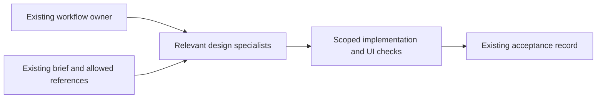

# Design pack integration

The design pack uses one task coordinator and keeps distinct owners for brief,
visual contract, flow, tokens, implementation, interaction polish and motion.
The full OpenDesign application adapter complements those portable methods.
Installing methods does not install or activate OpenDesign, a model provider,
an MCP server, a browser, native renderer or its resource library.

| Phase or capability | Canonical owner | Consolidation |
|---|---|---|
| Clarify design input | `design-brief` | OpenDesign's dimensions and explicit assumptions, without compulsory I-Lang or fixed palettes |
| Reusable visual direction | `reference-design-contract` | Reference evidence, keep/change boundaries, concrete decisions and handoff in the project's existing document shape |
| Journeys and states | `ux-flow-architect` | Existing portable UX owner; reuses the settled brief and contract |
| Tokens/components | `design-system-steward` | Existing owner; explicitly reads selected style/craft resources and maps them into the current system |
| Web visual implementation | `frontend-design` | Anthropic/OpenDesign method plus contextual Taste reference; preserves existing framework, brand and actual interaction states |
| Existing-artifact polish | `interaction-polish` | OpenDesign's Impeccable-inspired audit/critique/polish/harden method folded into the existing owner |
| Motion implementation/review | `motion-animation-engineer` | Emil design engineering and animation review folded into the existing owner with evidence-based findings |
| Native full application | `opendesign` | Seven native lanes, project/run/scenario/critique mechanisms, explicit CLI pass-through and read-only doctor |

There are no new hard dependencies between these skills. Optional named
helpers are routing hints, not instructions to load every design skill.
OpenDesign's full native route has external dependencies documented in its
[runtime reference](../plugins/rogemar-agent-toolkit/skills/opendesign/references/runtime.md).
Each environment uses its own available model and tools. No design method
dispatches agents, overrides model policy or creates a second orchestrator.

## Licensed sources and pin

Reviewed and adapted from OpenDesign `0.21.1`, source
`digitalpilipinas/open-design@ff2cc80f336f94786128113eddbbb9e3719fecc8`
(upstream `nexu-io/open-design`). The repo snapshot and per-entry notices are
recorded in each adapted skill/reference. OpenDesign is Apache-2.0;
Anthropic's frontend-design entry preserves its Apache-2.0 license. Taste
retains Copyright (c) 2026 Leonxlnx, MIT. The Emil and animation review entries
declare `emilkowalski/skills@a47903a06a05d2e24c483bd8961c85969a51a494` and retain
their source's Copyright (c) 2026 Matt Pocock, MIT notice. No claim of
endorsement or complete reproduction of an author's philosophy is made.

`taste-skill`, `taste-skill-v1`, and `gpt-tasteskill` were available as actual
licensed repository files. The portable reference adopts the contextual
brief-first method and composition/motion/density controls. It excludes
hardcoded global styling bans, mandatory frameworks, simulated randomization
and forced continuous motion. No private Taste profile/preferences were read
or copied. The Impeccable adaptation is from OpenDesign's entry, not the full
upstream Impeccable suite.

## Optional resource and application dependencies

The main toolkit catalog/installer owns dependency selection. Keep these as
optional pinned resources instead of copying the application/catalogue into
the default core:

- **Full application:** pinned source/build or platform distribution with its
  actual daemon/web/native dependencies. Source requires Node 24.x and pnpm
  10.33.2; native package compatibility and provider auth need live proof.
- **Templates:** selected complete bundles from `design-templates/` and any
  referenced skills/assets/fonts/scripts. Per-entry asset licenses and remote
  dependencies still apply; descriptor presence is not bundle completeness.
- **Styles and craft:** selected `design-systems/` and `craft/` packages with
  manifests, tokens and relative references. Portable consumers read them
  explicitly; only OpenDesign performs native prompt/resource staging.
- **Application scenarios/plugins:** remain real host resources, with snapshot
  binding, OD Next admission, connector grants and critique/run state intact.

At the reviewed pin, the Docker recipe omits agent CLIs and `design-templates/`.
HTML export is headless; PDF/image/PPTX needs a registered Electron renderer.
HyperFrames `0.8.1` needs browser/native rendering dependencies. Do not advertise
full VM/cloud library or export parity until the selected runtime proves it.

## Validation and limits

`tests/test_opendesign_adapter.py` exercises explicit/env/source resolution,
missing builds, POSIX `od` rejection, packaged runtime preconditions, all seven
native lane argument families, literal argv propagation, child exit codes,
environment preservation, and the doctor's no-execution/no-write/no-secret
output behavior. Fixtures do not run an application or provider.

The local doctor is intentionally a filesystem/configuration check; even a
`configured` result leaves daemon, Node/native compatibility, authentication,
connectors, selected resources and rendered output unverified. No installation,
service start, provider spending, auth migration, global configuration change
or publication is performed by skill installation or doctor. Native `run`
executes only the command explicitly requested by its caller, within that
caller's existing authority.

## Free Appllama method adaptation

Selected methods from Appllama/appllama-skills at
`dd5caaec3d5d50ad7fc0324da238119c6b7c3707` extend four existing owners:

| Owner | On-demand addition |
| --- | --- |
| reference-design-contract | Question-driven comparison, source attribution and reusable decisions |
| ux-flow-architect | Mobile navigation, return context, cancellation and completed-operation recovery |
| interaction-polish | Native controls, keyboard, safe areas, platform accessibility and full states |
| motion-animation-engineer | Gesture interruption, velocity, reduced motion and proportional evidence |

Each adapted skill includes LICENSE.appllama.txt and a pinned source link in its
new reference. Existing OpenDesign, Taste and Emil notices and roles remain.
Skill names, profile membership and installer interfaces are unchanged.

This is a methods-only adaptation: no Appllama MCP, subscription, credentials,
library content or media cache is included. It adds no fixed research count,
mandatory framework, image-generation spend or endless perfection loop. Native
OpenDesign services remain conditional on actual application tasks. Platform
checks use available authorized tooling; absent cloud/device runtimes do not
turn source inspection into UI proof. Packaging checks establish instruction and
license portability, not live device behavior or improved product outcomes.
